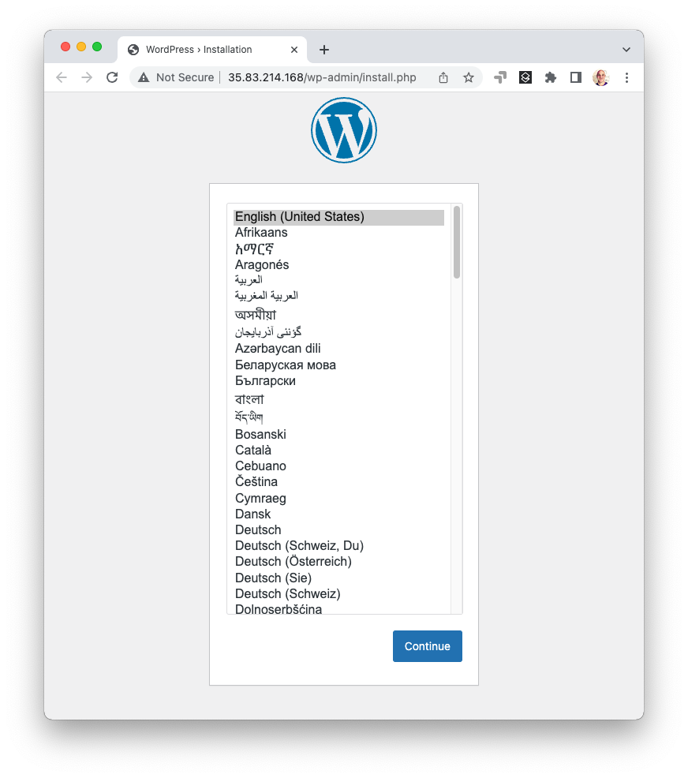

[](https://app.pulumi.com/new?template=https://github.com/pulumi/examples/blob/master/aws-cs-ansible-wordpress/README.md#gh-light-mode-only)
[](https://app.pulumi.com/new?template=https://github.com/pulumi/examples/blob/master/aws-cs-ansible-wordpress/README.md#gh-dark-mode-only)

# Deploy Wordpress to AWS EC2 using Pulumi and Ansible

This project demonstrates how to use Pulumi and Ansible together. Pulumi handles provisioning the AWS infrastructure
required to run Wordpress on an EC2 instance, with an RDS MySQL database, running inside of a VPC with proper public
and private subnets, and exposed to the Internet using an Elastic IP address. Ansible handles configuring the EC2
virtual machine after it's been provisioned with a playbook that knows how to install and configure Wordpress.
The entire deployment is orchestrated by Pulumi in a single `pulumi up` thanks to the
[Command package](https://www.pulumi.com/registry/packages/command) which runs a combination of local and remote SSH
commands to accomplish the desired effect. The result is repeatable automation that both provisions and configures.

> Note: This code was adapted from https://github.com/devbhusal/terraform-ansible-wordpress. Thank you devbhusal!

> Note: This example is available in many languages:
>
> * [C#](../aws-cs-ansible-wordpress)
> * [Java](../aws-java-ansible-wordpress)
> * [Go](../aws-go-ansible-wordpress)
> * [TypeScript](../aws-ts-ansible-wordpress)
> * [YAML](../aws-yaml-ansible-wordpress)

## Prerequisites

* [Install Pulumi](https://www.pulumi.com/docs/get-started/install/)
* [Install Ansible](https://docs.ansible.com/ansible/latest/installation_guide/intro_installation.html)
* [Configure AWS Credentials](https://www.pulumi.com/docs/intro/cloud-providers/aws/setup/)

## Deploying Your Infrastructure

After cloning this repo, from this working directory, run these commands:

1. Create a new stack, an isolated deployment target for this example:

    ```bash
    $ pulumi stack init
    ```

2. Generate a key pair which will be used to access your EC2 instance over SSH:

    ```bash
    $ ssh-keygen -f wordpress-keypair
    ```

   This will create two files: your private (`wordpress-keypair`) and your public (`wordpress-keypair.pub`)
   keys. Keep your private key safe, since anybody with access to it can log into your EC2 machine!

   Note that you may choose a different file name if you're creating multiple stacks, for instance.

3. Set the required configuration variables, choosing any valid AWS region. The code is written in such
   a way to work in any AWS region, including fetching the right Amazon Linux 2 AMI and availability zones:

    ```bash
    $ pulumi config set aws:region us-east-1 # any valid AWS region
    $ pulumi config set publicKeyPath wordpress-keypair.pub # your newly generated public key
    $ pulumi config set privateKeyPath wordpress-keypair # your newly generated private key
    $ pulumi config set dbPassword Sup45ekreT#123 --secret # your RDS database password -- keep it safe!
    ```

    There are some other optional variables you can set if you choose. Feel free to skip these. If you don't
    set them, they'll receive the default values shown below:

    ```bash
    $ pulumi config set dbInstanceSize db.t3.small # the RDS instance size to use
    $ pulumi config set dbName wordpressdb # the name of the Wordpress database in RDS
    $ pulumi config set dbUsername admin # the name of the Wordpress user that will be used
    $ pulumi config set ec2InstanceSize t3.small # the EC2 instance size to provision
    ```

4. Now all you need to do is run `pulumi up`. This will do all of the magic, and you'll see various
   things going on in the output: resources being created in AWS, commands being run locally and remotely,
   and the Ansible Playbook running and provisioning your Wordpress server:

    ```bash
    $ pulumi up
    Updating (dev)

         Type                              Name                          Status      Info
     +   pulumi:pulumi:Stack               pulumi-ansible-wordpress-dev  created
     +   ├─ aws:ec2:Vpc                    prod-vpc                      created
     +   ├─ aws:ec2:KeyPair                wordpress-keypair             created
     +   ├─ aws:ec2:Subnet                 prod-subnet-private-1         created
     +   ├─ aws:ec2:InternetGateway        prod-igw                      created
     +   ├─ aws:ec2:Subnet                 prod-subnet-private-2         created
     +   ├─ aws:ec2:Subnet                 prod-subnet-public-1          created
     +   ├─ aws:ec2:SecurityGroup          ec2-allow-rule                created
     +   ├─ aws:ec2:RouteTable             prod-public-rt                created
     +   ├─ aws:rds:SubnetGroup            rds-subnet-grp                created
     +   ├─ aws:ec2:SecurityGroup          rds-allow-rule                created
     +   ├─ aws:rds:Instance               wordpressdb                   created
     +   ├─ aws:ec2:RouteTableAssociation  prod-rta-public-subnet-1      created
     +   ├─ aws:ec2:Instance               wordpress-instance            created
     +   ├─ command:local:Command          renderPlaybookCmd             created
     +   ├─ aws:ec2:Eip                    wordpress-eip                 created
     +   ├─ command:remote:Command         updatePythonCmd               created     12 messages
     +   └─ command:local:Command          playAnsiblePlaybookCmd        created

    Diagnostics:
      command:remote:Command (updatePythonCmd):
    ...

    Outputs:
        url: "35.83.214.168"

    Resources:
        + 18 created

    Duration: 8m13s
    ```

5. After a few minutes, your new server will be ready! Its automatically-allocated EIP is printed at the end
   as `url`. You can access it with the `pulumi stack output` command:

    ```bash
    $ pulumi stack output url
    35.83.214.168
    ```

6. Because of the network configuration, the EC2 server is available over port 80 on the Internet. (The RDS
   database, on the other hand, is not). Let's `curl` the endpoint:

    ```bash
    $ curl -L http://$(pulumi stack output url)
    <!DOCTYPE html>
    <html lang="en-US" xml:lang="en-US">
    <head>...</head>
    <body class="wp-core-ui language-chooser">
    ...
    ```

   Alternatively, open a web browser to interact with your new Wordpress server:

    ```bash
    $ open http://$(pulumi stack output url)
    ```

    

7. From there, feel free to experiment. You can simply make edits, rerun `pulumi up`, and it will incrementally
   update and deploy any changes you have made.

8. After you're done, you can destroy your stack and remove it, eliminating all AWS resources:

    ```bash
    $ pulumi destroy
    $ pulumi stack rm
    ```
