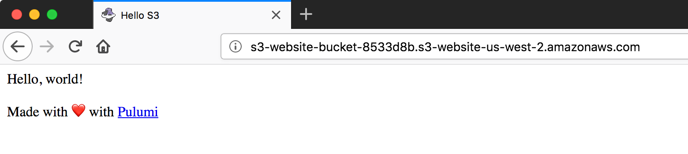

# Static Website Hosted on AWS S3

A static website that uses [S3's website support](https://docs.aws.amazon.com/AmazonS3/latest/dev/WebsiteHosting.html).
For a detailed walkthrough of this example, see the tutorial [Static Website on AWS S3](https://pulumi.io/quickstart/aws-s3-website.html).

## Getting Started (Pulumi Cloud Console)

Create a new project from this example in the [Pulumi Cloud Console](https://app.pulumi.com/) by clicking the 'Deploy with Pulumi' button:

[](https://app.pulumi.com/new)

After creating the project, a command will be provided (e.g. `pulumi new https://github.com/pulumi/examples/aws-js-s3-folder -s <owner>/<stack-name>`) that you can run to get the source code and preview an initial deployment.

When you run the command, you'll be presented a preview of the AWS resources that will be created.  Once you've reviewed and selected "Yes", the deployment will begin.

## Getting Started (Command Line)

Alternatively, you can create a new project from the example entirely from the command line by running:

```bash
$ pulumi new https://github.com/pulumi/examples/aws-js-s3-folder
```

You'll have a chance to configure a few settings, such as the project name, project description, stack name, and AWS region to deploy into.  You'll then be presented a preview of the AWS resources that will be created.  Once you've reviewed and selected "Yes", the deployment will begin.

## Next Steps

> Note: some values in this example will be different from run to run.  These values are indicated with `***`.

1.  To see the resources that were created, run `pulumi stack output`:

    ```bash
    $ pulumi stack output
    Current stack outputs (2):
        OUTPUT                                           VALUE
        bucketName                                       s3-website-bucket-***
        websiteUrl                                       ***.s3-website-us-west-2.amazonaws.com
    ```

1.  To see that the S3 objects exist, you can either use the AWS Console or the AWS CLI:

    ```bash
    $ aws s3 ls $(pulumi stack output bucketName)
    2018-04-17 15:40:47      13731 favicon.png
    2018-04-17 15:40:48        249 index.html
    ```

1.  Open the site URL in a browser to see both the rendered HTML and the favicon:

    ```bash
    $ pulumi stack output websiteUrl
    ***.s3-website-us-west-2.amazonaws.com
    ```

    

1.  To clean up resources, run `pulumi destroy` and answer the confirmation question at the prompt.

1.  To delete the stack, run `pulumi stack rm`.
