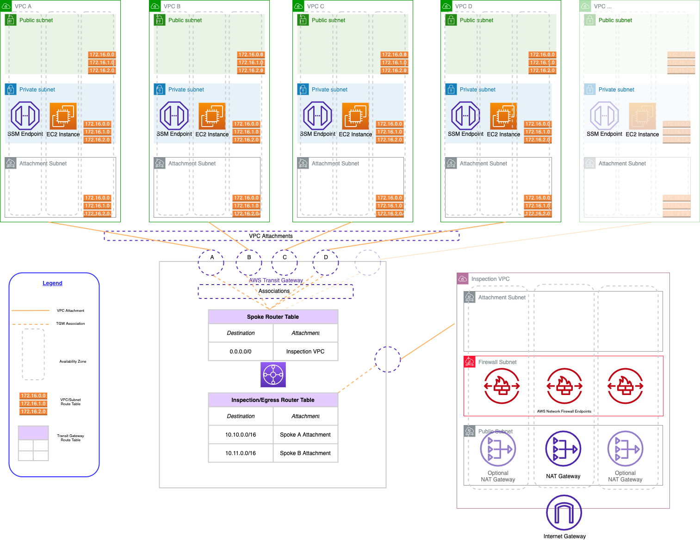

[](https://app.pulumi.com/new?template=https://github.com/pulumi/examples/blob/master/aws-py-hub-and-spoke-network/README.md#gh-light-mode-only)
[](https://app.pulumi.com/new?template=https://github.com/pulumi/examples/blob/master/aws-py-hub-and-spoke-network/README.md#gh-dark-mode-only)

# Hub-and-Spoke Network with Centralized Egress and Traffic Inspection use AWS Transit Gateway and AWS Firewall

This example creates a hub and spoke network in AWS with centralized egress and (optional) traffic inspection using AWS VPC, AWS Transit Gateway, and AWS Firewall for traffic inspection. The code creates 2 spoke networks, but additional networks can be added quickly added by modifying the code (see "Additional Options" below).

## About the Architecture

A hub-and-spoke network is a common architecture for creating a network topology that provides isolation and security for your workloads. The hub-and-spoke architecture you'll be creating on AWS has three main components: an inspection VPC, AWS Transit Gateway, and a series of spoke VPCs.

* The **inspection VPC** provides centralized egress. It is the only VPC that has a route to the internet, so all other VPCs in the architecture must route their traffic through the inspection VPC. The inspection VPC has optional traffic inspection capabilities.
* Network connectivity between VPCs is accomplished via **[AWS Transit Gateway](https://aws.amazon.com/transit-gateway/)**. The Transit Gateway maintains a central routing table that is used to route traffic from the spoke VPCs to the internet. We also need to maintain routes so that return traffic from the internet can be routed back to the correct spoke VPC.
* The **spoke VPCs** are where we run our application workloads. They are isolated from each other and cannot communicate with each other unless we explicitly allow a network path. They will be able to communicate with the internet by default, but only through the inspection VPC's NAT gateways.



## Prerequisites

1. [Install Pulumi](https://www.pulumi.com/docs/get-started/install/)
2. [Configure AWS Credentials](https://www.pulumi.com/registry/packages/aws/installation-configuration/)
3. [Install Python](https://www.pulumi.com/docs/intro/languages/python/)

## Deploy The App

### Step 1: Initialize the Project

For Pulumi examples, we typically start by creating a directory and changing into it. Then, we create a new Pulumi project from a template. For example, `azure-javascript`.

1. Install packages:

    ```bash
    python3 -m venv venv
    venv/bin/pip install -r requirements.txt
    ```

2. Create a new Pulumi stack:

    ```bash
    pulumi stack init
    ```

3. Configure the AWS region to deploy into:

    ```bash
    pulumi config set aws:region us-east-2
    ```

4. Deploy the Pulumi stack:

    ```bash
    pulumi up
    ```

### Step 2: Test the Network

1. Take note of the `nat-gateway-eip` output from the stack. This is the Elastic IP address of the NAT gateway in the inspection VPC.
1. Log into the AWS Console in the region in which you deployed the project.
1. Navigate to the EC2 service home page.
1. Select one of the spoke workload instances and under "Actions", click "Connect".
1. Under the Session Manager section, click "Connect". This will create an terminal session to the instance.
1. Run the following command. The resulting output should be identical to the `nat-gateway-eip` output from the stack. This means that your EC2 instance is able to reach the internet through the NAT gateway in the inspection VPC.

    ```bash
    curl -s http://icanhazip.com
    ```

You can comment out the `SpokeWorkload` components after testing as it is not required for the network to function.

### Additional Options

There are several modifications to the code that can be made:

1. To enable traffic inspection, set the `create-firewall` config variable to `true`.

    ```bash
    pulumi config set create-firewall true
    ```

    By default, the firewall rules will only allow traffic to amazon.com. You can modify the rules by editing the contents of `firewall.py`.

1. To add additional spoke networks, initiate additional instances of the `SpokeVpc` component resource in `__main__.py`. Be sure that each spoke VPC has a CIDR block that does not overlap with any other spoke VPCs.

## Clean Up

Once you're finished experimenting, you can destroy your stack and remove it to avoid incurring any additional cost:

```bash
pulumi destroy
pulumi stack rm
```

## Troubleshooting

You may encounter a condition where the security group fails to delete. This may be due to incomplete deletion of VPC endpoints. To fix this condition, perform the following in the AWS console:

1. Delete all VPC endpoints in the VPC that contains the security group that is failing to delete. Wait for the endpoints to finish deleting.
1. Once the VPC endpoints are deleted, attempt to delete the security group in the console. If any ENIs are still using the security group, wait a few seconds and try again. ENIs created for VPC endpoints may take an additional minute or two to be deleted after deleting the associated VPC endpoint.
1. Run `pulumi destroy` again.

## Summary

In this tutorial, you created a hub and spoke network with centralized egress and (optional) traffic inspection. Now you can deploy workloads into the VPCs and enjoy the benefits of this architecture.
