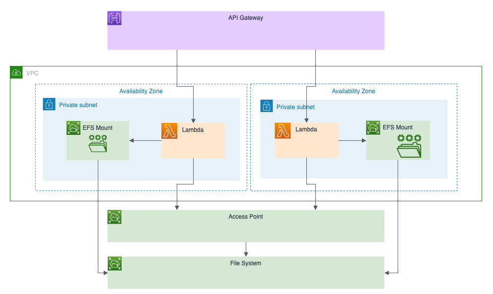

[](https://app.pulumi.com/new?template=https://github.com/pulumi/examples/blob/master/aws-ts-lambda-efs/README.md#gh-light-mode-only)
[](https://app.pulumi.com/new?template=https://github.com/pulumi/examples/blob/master/aws-ts-lambda-efs/README.md#gh-dark-mode-only)

# Using Amazon EFS with AWS Lambda

This example shows how to use Amazon EFS with AWS Lambda in Pulumi. See the [Using AWS Lambda with Amazon Elastic File System (EFS)](https://www.pulumi.com/blog/aws-lambda-efs) blog post for a detailed walkthrough of this example.



## Prerequisites

- [Node.js](https://nodejs.org/en/download/)
- [Download and install the Pulumi CLI](https://www.pulumi.com/docs/get-started/install/)
- [Connect Pulumi with your AWS account](https://www.pulumi.com/docs/intro/cloud-providers/aws/setup/) (if your AWS CLI is configured, no further changes are required)

## Running the Example

After cloning this repo, `cd` into it and run these commands:

1. Create a new stack, which is an isolated deployment target for this example:

    ```bash
    $ pulumi stack init dev
    ```

2. Set your desired AWS region:

    ```bash
    $ pulumi config set aws:region us-east-1 # any valid AWS region will work
    ```

3. Deploy everything with a single `pulumi up` command. This will show you a preview of changes first, which
   includes all of the required AWS resources (clusters, services, and the like). Don't worry if it's more than
   you expected -- this is one of the benefits of Pulumi, it configures everything so that so you don't need to!

    ```bash
    $ pulumi up
    ```

    After being prompted and selecting "yes", your deployment will begin. It'll complete in a few minutes:

    ```
    Updating (demo):
        Type                                          Name                      Status
    +   pulumi:pulumi:Stack                           aws-ts-lambda-efs-demo    created
    +   ├─ awsx:x:ec2:Vpc                             vpc                       created
    +   │  ├─ aws:ec2:Vpc                             vpc                       created
    +   │  ├─ awsx:x:ec2:Subnet                       vpc-public-0              created
    +   │  │  ├─ aws:ec2:Subnet                       vpc-public-0              created
    +   │  │  ├─ aws:ec2:RouteTable                   vpc-public-0              created
    +   │  │  ├─ aws:ec2:Route                        vpc-public-0-ig           created
    +   │  │  └─ aws:ec2:RouteTableAssociation        vpc-public-0              created
    +   │  ├─ awsx:x:ec2:Subnet                       vpc-public-1              created
    +   │  │  ├─ aws:ec2:RouteTable                   vpc-public-1              created
    +   │  │  ├─ aws:ec2:Subnet                       vpc-public-1              created
    +   │  │  ├─ aws:ec2:RouteTableAssociation        vpc-public-1              created
    +   │  │  └─ aws:ec2:Route                        vpc-public-1-ig           created
    +   │  ├─ awsx:x:ec2:NatGateway                   vpc-1                     created
    +   │  │  ├─ aws:ec2:Eip                          vpc-1                     created
    +   │  │  └─ aws:ec2:NatGateway                   vpc-1                     created
    +   │  ├─ awsx:x:ec2:Subnet                       vpc-private-0             created
    +   │  │  ├─ aws:ec2:RouteTable                   vpc-private-0             created
    +   │  │  ├─ aws:ec2:Subnet                       vpc-private-0             created
    +   │  │  ├─ aws:ec2:RouteTableAssociation        vpc-private-0             created
    +   │  │  └─ aws:ec2:Route                        vpc-private-0-nat-0       created
    +   │  ├─ awsx:x:ec2:InternetGateway              vpc                       created
    +   │  │  └─ aws:ec2:InternetGateway              vpc                       created
    +   │  ├─ awsx:x:ec2:Subnet                       vpc-private-1             created
    +   │  │  ├─ aws:ec2:RouteTable                   vpc-private-1             created
    +   │  │  ├─ aws:ec2:Subnet                       vpc-private-1             created
    +   │  │  ├─ aws:ec2:RouteTableAssociation        vpc-private-1             created
    +   │  │  └─ aws:ec2:Route                        vpc-private-1-nat-1       created
    +   │  └─ awsx:x:ec2:NatGateway                   vpc-0                     created
    +   │     ├─ aws:ec2:Eip                          vpc-0                     created
    +   │     └─ aws:ec2:NatGateway                   vpc-0                     created
    +   ├─ aws:apigateway:x:API                       api                       created
    +   │  ├─ aws:apigateway:RestApi                  api                       created
    +   │  ├─ aws:apigateway:Deployment               api                       created
    +   │  ├─ aws:lambda:Permission                   api-2c087c3e              created
    +   │  ├─ aws:lambda:Permission                   api-c171fd88              created
    +   │  ├─ aws:lambda:Permission                   api-7857d17d              created
    +   │  └─ aws:apigateway:Stage                    api                       created
    +   ├─ awsx:x:ecs:FargateService                  nginx                     created
    +   │  └─ aws:ecs:Service                         nginx                     created
    +   ├─ awsx:x:ecs:FargateTaskDefinition           nginx                     created
    +   │  ├─ aws:iam:Role                            nginx-execution           created
    +   │  ├─ aws:cloudwatch:LogGroup                 nginx                     created
    +   │  ├─ aws:iam:Role                            nginx-task                created
    +   │  ├─ aws:iam:RolePolicyAttachment            nginx-execution-9a42f520  created
    +   │  ├─ aws:iam:RolePolicyAttachment            nginx-task-32be53a2       created
    +   │  ├─ aws:iam:RolePolicyAttachment            nginx-task-fd1a00e5       created
    +   │  └─ aws:ecs:TaskDefinition                  nginx                     created
    +   ├─ awsx:x:ec2:SecurityGroup                   nginx-0                   created
    +   ├─ awsx:x:ecs:Cluster                         cluster                   created
    +   │  ├─ aws:ecs:Cluster                         cluster                   created
    +   │  └─ awsx:x:ec2:SecurityGroup                cluster                   created
    +   │     ├─ awsx:x:ec2:IngressSecurityGroupRule  cluster-containers        created
    +   │     │  └─ aws:ec2:SecurityGroupRule         cluster-containers        created
    +   │     ├─ awsx:x:ec2:EgressSecurityGroupRule   cluster-egress            created
    +   │     │  └─ aws:ec2:SecurityGroupRule         cluster-egress            created
    +   │     ├─ awsx:x:ec2:IngressSecurityGroupRule  cluster-ssh               created
    +   │     │  └─ aws:ec2:SecurityGroupRule         cluster-ssh               created
    +   │     └─ aws:ec2:SecurityGroup                cluster                   created
    +   ├─ aws:iam:Role                               getHandler                created
    +   ├─ aws:iam:Role                               execHandler               created
    +   ├─ aws:efs:FileSystem                         filesystem                created
    +   ├─ aws:iam:Role                               uploadHandler             created
    +   ├─ aws:iam:RolePolicyAttachment               execHandler-32be53a2      created
    +   ├─ aws:iam:RolePolicyAttachment               execHandler-23f1a522      created
    +   ├─ aws:iam:RolePolicyAttachment               getHandler-32be53a2       created
    +   ├─ aws:iam:RolePolicyAttachment               getHandler-23f1a522       created
    +   ├─ aws:iam:RolePolicyAttachment               uploadHandler-32be53a2    created
    +   ├─ aws:iam:RolePolicyAttachment               uploadHandler-23f1a522    created
    +   ├─ aws:efs:MountTarget                        fs-mount-1                created
    +   ├─ aws:efs:MountTarget                        fs-mount-0                created
    +   ├─ aws:efs:AccessPoint                        ap                        created
    +   ├─ aws:lambda:Function                        getHandler                created
    +   ├─ aws:lambda:Function                        uploadHandler             created
    +   └─ aws:lambda:Function                        execHandler               created

    Outputs:
        url: "https://280f2167f1.execute-api.us-east-1.amazonaws.com/stage/"

    Resources:
        + 75 created

    Duration: 5m52s
    ```

4. At this point, your app is running! The URL was published so it's easy to interact with:

    ```bash
    $ curl -X POST -d '<h1>Hello world</h1>' $(pulumi stack output url)files/index.html
    $ curl -X GET $(pulumi stack output url)files/index.html
    <h1>Hello world</h1>
    ```

5. Once you are done, you can destroy all of the resources, and the stack:

    ```bash
    $ pulumi destroy
    $ pulumi stack rm
    ```
