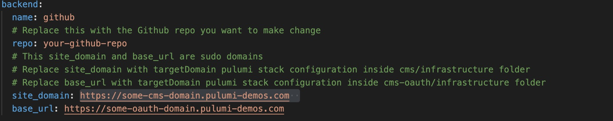

## Background Knowledges
CMS stands for content management system, which facilitate creation and modification of digital content.

[Netlify CMS](https://www.netlifycms.org/docs/intro/) is an [open-source](https://github.com/netlify/netlify-cms) example implements this concept.  It works closely with static site generators and provides user interface for non-technical editors of webisite to edit the website content and submit the change to various types of storaging service including Github.

Backends allows Netlify CMS to communicate with a service that stores content. Backends that Netlify CMS provides includes Git Gateway (Connect with Netlify), Github, GitLab, and Bitbucket.

# About CMS Project
This project is an CMS React App that using Netlify CMS as CMS provider and Github as backend. Orginally it provides a user interface for non-technical employees from Pulumi to edit [Pulumi's website](https://github.com/pulumi/docs) (powered by [Hugo static site generator](https://gohugo.io)). 
It is a good example for how to deploy Netlify CMS as a stand-alone React web application that is reading and make changes to another organization repository and deployed on AWS instead of Netlify.
Special thanks to the template provided by [@talves](https://github.com/ADARTA/netlify-cms-react-example
) for converting the CMS to be a stand-alone React app that is not placed inside the target repository.

## File Path

- .github/workflow
  - The implementation of Github Actions workflow
- cms/infrastructure
  - The infrastructure of deploying cms app on AWS using Pulumi.
  - index.ts contain the code for the Pulumi program
- cms/public
  - config.yml is the Netlify CMS's configuration file
  - favicon.ico the icon for CMS app website
  - index.html the html for the web app to check
- cms/Readme-Screenshots
  - The screen shots for this README file
- cms/src
  - React content for this web app

## Infrastructure

The infrastructure folder contain Pulumi code of deploying this CMS app onto the AWS S3, speeding up using AWS CloudFront, and certificate creation using AWS Certificate Manager. The general idea is deploy the CMS application as a static website onto the AWS. We already have a [Pulumi's static website creation example](https://github.com/pulumi/examples/tree/master/aws-ts-static-website) with explanation provided.

The infrastructure takes three argument: pathToWebsiteContents,targetDomain, certificateArn.
- pathToWebsiteContents
  - The path to the builded content of this React Website app.
  - Run a yarn build will create a build folder which contains the builded file and we should pass the directory of the build folder to this variable.
  - Passing build folder instead of the whole folder is to put a worked version onto AWS S3 bucket for CloudFront to look for
- targetDomain
  - a target domain name that you wish to put into.
  - we used a subdomain of a parent domain and the parent domain have to be alive on your AWS account's Route 53 console it would automatically create the subdomain for you
  - this is also the site_domain you should put inside the cms/public/config.yml for Netlify CMS to read
- certificateArn
  - This is optional.
  - If you have already had a certificate inside the AWS's Certificate Manager for this CMS app, then put it's arn as the value for this variable

### Assume Role (Optional)
If you are working with an organization, it is better to ask for the AWS token for IAM user role that you could use to assume the admin role of your AWS account. In this way it is more secure. You could refer to the [aws-ts-assume-role example](https://github.com/pulumi/examples/tree/master/aws-ts-assume-role) for more information. There is also assume role example of different language in [our example repostiory](https://github.com/pulumi/examples)

## Substitution for Netlify Identity Service: OAuth Client Server
Deploying the CMS app on AWS but not Netlify cause we could not use the Netlify Identity Service with the Netlify console. Thus, we created a new OAuth Client Server follow [instruction of Netlify CMS](https://www.netlifycms.org/docs/external-oauth-clients/). In short it fetch access token from Github API to grant people access to use the CMS. The resource of the OAuth Server is inside the ./cms-oauth folder in the root directory.

After deploying the cms-oauth web app, we should also put the domain of the oauth-server we build in the cms/public/config.yml's base_url configuration

## Code Path

1. The enter point for this app was in **public/index.html** which includes multiple scripts and the div with id root for inserting the CMS content.

1. **src/index.js** which create an App React DOM from **src/App.js** and insert into the div with id root in the public/index.html. 

1. App.js then create NetlifyCMS component instance from **src/components/NetlifyCMS** folder.

1. **src/components/NetlifyCMS/index.js** specify the behavior for NetlifyCMS and we could register CMS custom templates, custom widget there. 

1. CMS.init() will initialize CMS using **public/config.yml** which is the core of this app, which contains collection, backend settings, and other settings

## Development Details
Now Github workflow was implemented. Directly push to master branch would automatically deploy cms to http://cms.corptron9000.pulumi.com/
Open a new branch and commit to the new branch would only do a pulumi preview until merge, which you could see from the Github Actions. For testing:

### Local Development

1. Specify the repo, site_domain and base_url in the cms/public/config.yml's backend block.

  repo is the target repo you would like CMS to view and make edits on
  site_domain is the domain name for the CMS web application
  base_url is the domain name for the oauth server that we specify in cms-oauth folder

1. To check if config.yml works and do a simple local deployment

```bash
yarn start
```
It would automatically update if you made another change to config.yml

### 
1. Build the App

```bash
yarn build
```
This would build the App and create a build folder under root directory. 

2. Go to infrastructure folder config the Pulumi stack

```bash
$ cd infrastructure
$ pulumi stack init pulumi-website-cms
$ pulumi config set aws:region us-east-1
$ pulumi config set pulumi-website-cms:pathToWebsiteContents ../build
$ pulumi config set pulumi-website-cms:targetDomain https://some-cms-domain.pulumi-demos.com
# the targetDomain have to match what you put for site_domain inside the config file ./cms/public/config.yml
```
- path to website contents would specify the folder generated by yarn build and upload that folder to S3

- target domain is the domain for the App now it is as subdomain under pulumi-demos.net

4. Run pulumi up
```bash
$ pulumi up
```

## CMS UI Introduction

1.  Open up a server with working example with

    ```bash
    $ yarn start
    ```
    it will automatically updated the page with any changes.

2.  Login using Github account.

    

3.  Click on any page you want to edit at collections page or add new page using the "New Webinar/Event Page" button

    

    Fill in in specified field at the entry page

    

> For images uploads, currently all images that webinar pages requires would be uploaded to *static/images/webinar* related to root in docs repository including preview image and icon image.

4. Click save button at the top of the editing page would 
- create a new branch at docs repo
- open a pull request 
- make initial commit to the branch
- add tag to the commit says "drafts"
- produce a card at the drafts column on the editorial workflow page (mentioned in 5. 6.)

5. Click the Back button to go back to the collections page and clicking the **Workflow** button would bring out the editorial workflow

    

    

6. Moving a card from the "Drafts" column to the "In Review" column will remove the "draft" tag and apply an "in-review" tag on the PR

7. Similarly, moving a card from "In Review" to "Ready" columns would change the PR tag to "ready"

8. Hover on the card in "Ready" column would show **Publish change** button, which would merge the PR.


