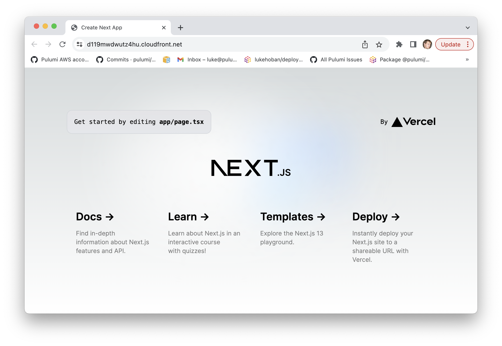

[](https://app.pulumi.com/new?template=https://github.com/pulumi/examples/blob/master/aws-ts-nextjs/README.md#gh-light-mode-only)
[](https://app.pulumi.com/new?template=https://github.com/pulumi/examples/blob/master/aws-ts-nextjs/README.md#gh-dark-mode-only)

# Next.js on AWS

This example deploys a Next.js site on AWS using [OpenNext](https://open-next.js.org/).

## Deploying the App

To deploy your app, follow the below steps.

### Prerequisites

1. [Install Pulumi](https://www.pulumi.com/docs/get-started/install/)
2. [Install Node.js](https://nodejs.org/en/download/)
3. [Configure AWS Credentials](https://www.pulumi.com/registry/packages/aws/installation-configuration/)

### Steps

After cloning this repo, from this working directory, run these commands:

1. Install the required Node.js packages:

    ```bash
    $ npm install
    ```

2. Create a new stack, which is an isolated deployment target for this example:

    ```bash
    $ pulumi stack init
    ```

3. Set the required configuration variables for this program:

    ```bash
    $ pulumi config set aws:region us-west-2
    ```

   You can select any AWS region you would like to use.

4. Deploy your application to it's own dedicated serving infrastructure in AWS.

    ```bash
    $ pulumi up
    ```

5. Most of the infrastructure will deploy within about 30s, but the CloudFront CDN can take 4-5 minutes.  After this is complete, a CloudFront URL where your application is served will be shown.


    ```bash
    Outputs:
        url: "https://d119mwdwutz4hu.cloudfront.net"

    Resources:
        + 45 created

    Duration: 4m14s
    ```

6. You can open that URL in your browser to see your Next.js demo app.

    

7. Make changes to the Next.js app in the `demoapp` folder, or bring your own Next.js app and point the Pulumi component at it instead.

8. Once you've finished experimenting, tear down your stack's resources by destroying and removing it:

    ```bash
    $ pulumi destroy --yes
    $ pulumi stack rm --yes
    ```
