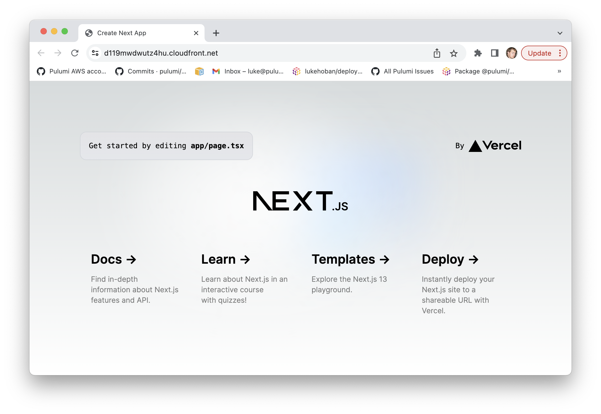

[](https://app.pulumi.com/new?template=https://github.com/pulumi/examples/blob/master/aws-ts-nextjs/README.md#gh-light-mode-only)
[](https://app.pulumi.com/new?template=https://github.com/pulumi/examples/blob/master/aws-ts-nextjs/README.md#gh-dark-mode-only)

# Next.js on AWS

This example deploys a Next.js site on AWS using [OpenNext](https://open-next.js.org/).

## Prerequisites

1. [Install Pulumi](https://www.pulumi.com/docs/get-started/install/)
2. [Configure AWS Credentials](https://www.pulumi.com/docs/intro/cloud-providers/aws/setup/)
3. [Install Node.js](https://www.pulumi.com/docs/intro/languages/javascript/)

## Deploying the example

1.  Create a new stack, which is an isolated deployment target for this example:

    ```bash
    pulumi stack init
    ```

1.  Set the AWS region to deploy into:

    ```bash
    pulumi config set aws:region us-west-2
    ```

1.  Install dependencies:

    ```bash
    npm install
    ```

1.  Deploy the stack:

    ```bash
    pulumi up
    ```

    Most of the infrastructure will deploy within about 30s, but the CloudFront CDN can take 4-5 minutes. After this is complete, a CloudFront URL where your application is served will be shown.

    ```
    Outputs:
        url: "https://d119mwdwutz4hu.cloudfront.net"

    Resources:
        + 45 created

    Duration: 4m14s
    ```

1.  Open that URL in your browser to see your Next.js demo app.

    

1.  Make changes to the Next.js app in the `demoapp` folder, or bring your own Next.js app and point the Pulumi component at it instead.

## Cleaning up

Once you've finished experimenting, tear down your stack's resources by destroying and removing it:

```bash
pulumi destroy
pulumi stack rm
```
