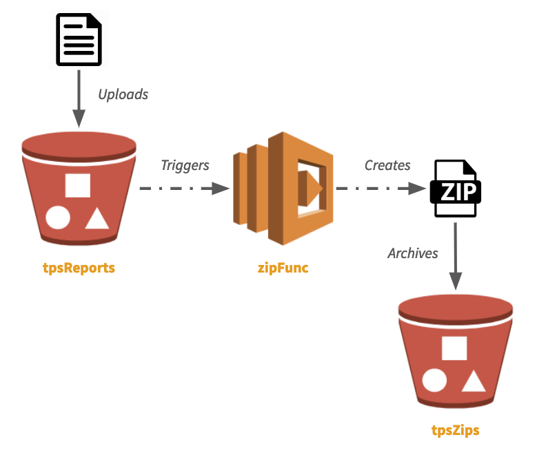

[](https://app.pulumi.com/new?template=https://github.com/pulumi/examples/blob/master/aws-ts-s3-lambda-copyzip/README.md#gh-light-mode-only)
[](https://app.pulumi.com/new?template=https://github.com/pulumi/examples/blob/master/aws-ts-s3-lambda-copyzip/README.md#gh-dark-mode-only)

# Serverless app to copy and zip objects between Amazon S3 buckets

This example sets up two AWS S3 Buckets and a single Lambda that listens to one and, upon each new
object arriving in it, zips it up and copies it to the second bucket. Its architecture looks like this:



This example is also featured in the blog post [Easy Serverless Apps and Infrastructure --
Real Events, Real Code](https://www.pulumi.com/blog/easy-serverless-apps-and-infrastructure-real-events-real-code/).

## Prerequisites

1. [Install Pulumi](https://www.pulumi.com/docs/get-started/install/)
2. [Configure AWS credentials](https://www.pulumi.com/docs/intro/cloud-providers/aws/setup/)
3. [Install Node.js](https://www.pulumi.com/docs/intro/languages/javascript/)

## Deploying the example

1.  Create a new stack, which is an isolated deployment target for this example:

    ```bash
    pulumi stack init dev
    ```

1.  Set the AWS region to deploy into:

    ```bash
    pulumi config set aws:region us-east-1
    ```

1.  Install dependencies:

    ```bash
    npm install
    ```

1.  Deploy the stack:

    ```bash
    pulumi up
    ```

1.  After about 20 seconds, your buckets and lambda will have been deployed. Their names are printed:

    ```
    Outputs:
        tpsReportsBucket: "tpsreports-21b7b7a"
        tpsZipsBucket   : "tpszips-c869600"
    ```

1.  Copy a file to the `tpsReportsBucket` using the AWS CLI:

    ```bash
    aws s3 cp ./myTpsReport001.txt s3://$(pulumi stack output tpsReportsBucket)
    ```

1.  Tail the logs to see evidence the Lambda ran:

    ```bash
    pulumi logs -f
    ```

    ```
    Collecting logs for stack dev since 2019-03-10T10:09:56.000-07:00...
    2019-03-10T11:10:48.617-07:00[zipTpsReports] Zipping
        tpsreports-96458ef/tps001.txt into tpszips-edfde11/tps001.txt.zip
    ```

1.  Press `^C` to exit `pulumi logs -f`, and then download your new zipfile:

    ```bash
    aws s3 cp s3://$(pulumi stack output tpsZipsBucket)/myTpsReport001.txt.zip .
    ```

## Cleaning up

Once you're done, delete the bucket contents (by default, bucket content isn't auto-deleted), then
destroy your stack and remove it:

```bash
aws s3 rm s3://$(pulumi stack output tpsReportsBucket)/myTpsReport001.txt
aws s3 rm s3://$(pulumi stack output tpsZipsBucket)/myTpsReport001.txt.zip
pulumi destroy
pulumi stack rm
```
