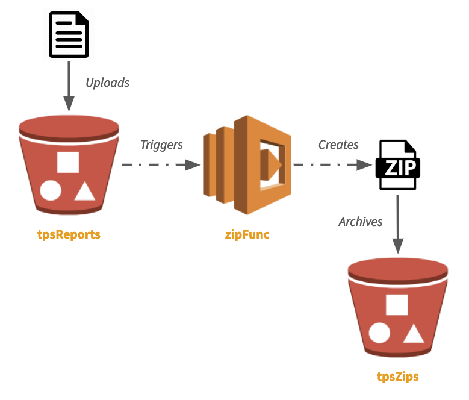

[](https://app.pulumi.com/new?template=https://github.com/pulumi/examples/blob/master/aws-ts-s3-lambda-copyzip/README.md)

# Serverless App to Copy and Zip Objects Between Amazon S3 Buckets

This example sets up two AWS S3 Buckets and a single Lambda that listens to one and, upon each new
object arriving in it, zips it up and copies it to the second bucket. Its architecture looks like this:



This example is also featured in the blog post [Easy Serverless Apps and Infrastructure --
Real Events, Real Code](https://www.pulumi.com/blog/easy-serverless-apps-and-infrastructure-real-events-real-code/).

## Deploying the App

To deploy your new serverless application, follow the below steps.

### Prerequisites

0. [Ensure you have Node.js](https://nodejs.org/en/download/)
1. [Install Pulumi](https://www.pulumi.com/docs/get-started/install/)
2. [Configure AWS Credentials](https://www.pulumi.com/docs/intro/cloud-providers/aws/setup/)

### Steps

After cloning this repo, from this working directory, run these commands:

0. Install Node.js dependencies, either using NPM or Yarn:

    ```bash
    $ npm install
    ```

1. Create a new Pulumi stack, which is an isolated environment for this example:

    ```bash
    $ pulumi stack init
    ```

   This will ask you to give your stack a name; `dev` is a fine name to begin with.

2. Configure the AWS region for this program -- any valid AWS region will do:

    ```bash
    $ pulumi config set aws:region us-east-1
    ```

3. Deploy the application:

    ```bash
    $ pulumi up
    ```

4. After about 20 seconds, your buckets and lambda will have been deployed. Their names are printed:

    ```bash
    Outputs:
        tpsReportsBucket: "tpsreports-21b7b7a"
        tpsZipsBucket   : "tpszips-c869600"
    ```

5. Now copy a file to the `tpsReportsBucket` using the AWS CLI:

    ```bash
    $ aws s3 cp ./myTpsReport001.txt s3://$(pulumi stack output tpsReportsBucket)
    ```

6. Tail the logs to see evidence the Lambda ran:

    ```bash
    $ pulumi logs -f
    Collecting logs for stack dev since 2019-03-10T10:09:56.000-07:00...
    2019-03-10T11:10:48.617-07:00[zipTpsReports] Zipping
        tpsreports-96458ef/tps001.txt into tpszips-edfde11/tps001.txt.zip
    ```

7. ^C out of `pulumi logs -f`, and then download your new zipfile!

    ```bash
    $ aws s3 cp s3://$(pulumi stack output tpsZipsBucket)/myTpsReport001.txt.zip .
    ```

7. Once you're done, destroy your stack and remove it -- eliminating all traces of running:

    ```bash
    # First, delete files so we can destroy the buckets (by default, bucket content isn't auto-deleted):
    $ aws s3 rm s3://$(pulumi stack output tpsReportsBucket)/myTpsReport001.txt
    $ aws s3 rm s3://$(pulumi stack output tpsZipsBucket)/myTpsReport001.txt.zip
    $ pulumi destroy --yes
    $ pulumi stack rm --yes
    ```
