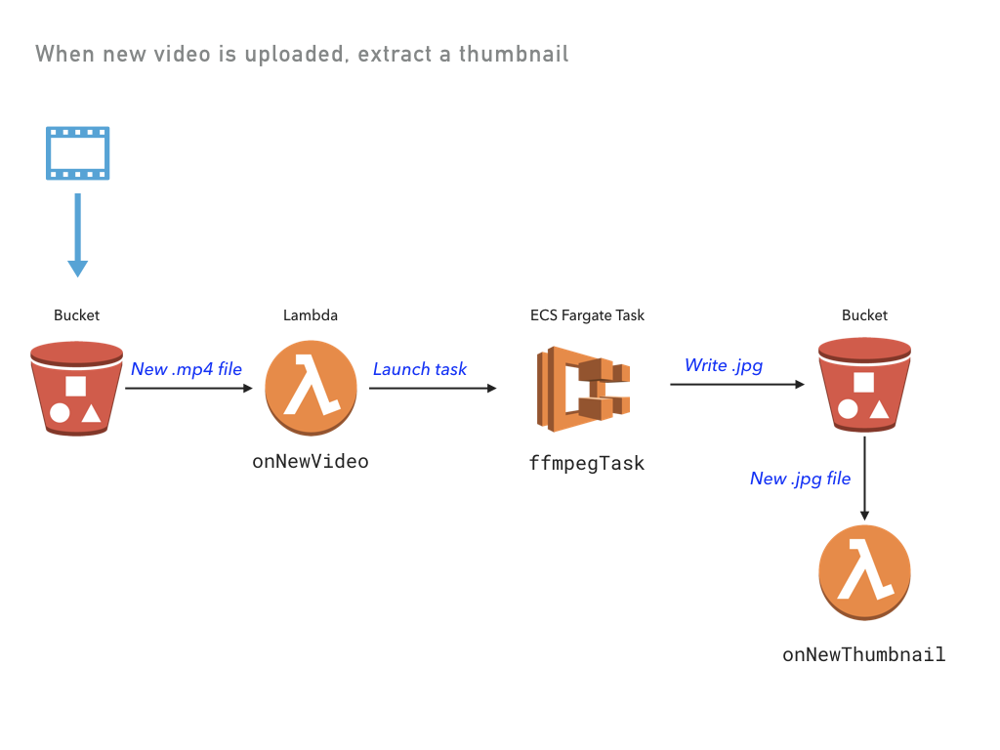

[](https://app.pulumi.com/new?template=https://github.com/pulumi/examples/blob/master/aws-ts-thumbnailer/README.md#gh-light-mode-only)
[](https://app.pulumi.com/new?template=https://github.com/pulumi/examples/blob/master/aws-ts-thumbnailer/README.md#gh-dark-mode-only)

# Video Thumbnailer Using AWS Fargate

A video thumbnail extractor using serverless functions and containers.

Loosely derived from the example at https://serverless.com/blog/serverless-application-for-long-running-process-fargate-lambda/.



## Prerequisites

To run this example, make sure [Docker](https://docs.docker.com/engine/installation/) is installed and running.

## Running the App

Note: some values in this example will be different from run to run.  These values are indicated
with `***`.

1.  Create a new stack:

    ```
    pulumi stack init thumbnailer-testing
    ```

1.  Configure Pulumi to use an AWS region where Fargate is supported, which is currently only available in `us-east-1`, `us-east-2`, `us-west-2`, and `eu-west-1`:

    ```
    pulumi config set aws:region us-west-2
    ```

1.  Restore NPM modules via `npm install` or `yarn install`.

1.  Preview and deploy the app via `pulumi up`. The preview will take some time, as it builds a Docker container. A total of 32 resources are created.

    ```
    $ pulumi up
    Previewing update of stack 'thumbnailer-testing'
    Previewing changes:

        Type                                Name                                   Plan          Info
    *   global                              global                                 no change     1 info message. info: Building container image 'pulum-
    +   pulumi:pulumi:Stack                       video-thumbnailer-thumbnailer-testing  create...     1 info message. info: Successfully tagged pulum-
    ...

    Do you want to perform this update? yes
    Updating stack 'thumbnailer-testing'
    Performing changes:

        Type                                Name                                   Status        Info
    *   global                              global                                 unchanged     1 info message. info: Building container image 'pulum-
    +   pulumi:pulumi:Stack                 video-thumbnailer-thumbnailer-testing  created      1 info message. info: 081c66fa4b0c: Pushed
    + ...
    ...

    info: 32 changes performed:
        + 32 resources created
    Update duration: ***

    Permalink: https://app.pulumi.com/***
    ```

1.  View the stack outputs:

    ```
    $ pulumi stack output
    Current stack outputs (1):
        OUTPUT                                           VALUE
        bucketName                                       ***
    ```

1.  Upload a video, embedding the timestamp in the filename:

    ```
    $ aws s3 cp ./sample/cat.mp4 s3://$(pulumi stack output bucketName)/cat_00-01.mp4
    upload: sample/cat.mp4 to s3://***/cat_00-01.mp4
    ```

1.  View the logs from both the Lambda function and the ECS task:

    ```
    $ pulumi logs -f
    Collecting logs for stack thumbnailer-testing since ***

    2018-05-25T12:57:26.326-07:00[                    onNewVideo] *** New video: file cat_00-01.mp4 was uploaded at 2018-05-25T19:57:25.507Z.
    2018-05-25T12:57:30.705-07:00[                    onNewVideo] Running thumbnailer task.
    2018-05-25T12:58:34.960-07:00[               ffmpegThumbTask] Starting ffmpeg task...
    2018-05-25T12:58:34.960-07:00[               ffmpegThumbTask] Copying video from S3 bucket-5ea6b28/cat_00-01.mp4 to cat_00-01.mp4...
    2018-05-25T12:58:37.267-07:00[               ffmpegThumbTask] Completed 256.0 KiB/666.5 KiB (2.5 MiB/s) with 1 fildownload: s3://bucket-5ea6b28/cat_00-01.mp4 to ./cat_00-01.mp4
    2018-05-25T12:58:40.306-07:00[               ffmpegThumbTask] Copying cat.jpg to S3 at bucket-5ea6b28/cat.jpg ...
    2018-05-25T12:58:43.034-07:00[               ffmpegThumbTask] Completed 86.6 KiB/86.6 KiB (619.7 KiB/s) with 1 filupload: ./cat.jpg to s3://bucket-5ea6b28/cat.jpg
    2018-05-25T12:58:43.758-07:00[                onNewThumbnail] *** New thumbnail: file cat.jpg was saved at 2018-05-25T19:58:43.028Z.
        ```

1.  Download the key frame:

    ```
    $ aws s3 cp s3://$(pulumi stack output bucketName)/cat.jpg .
    download: s3://***/cat.jpg to ./cat.jpg
    ```

## Clean up

To clean up the resources, you will first need to clear the contents of the bucket.

```bash
aws s3 rm s3://$(pulumi stack output bucketName) --recursive
```

Then, run `pulumi destroy` and answer the confirmation question at the prompt.
