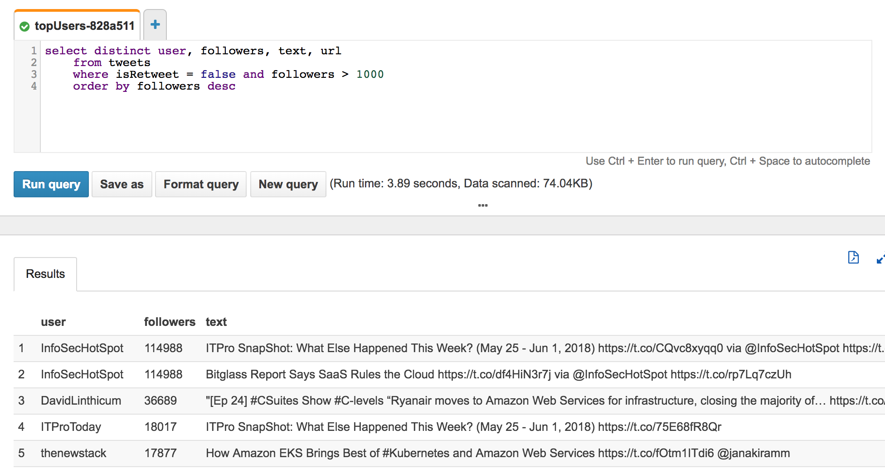

[](https://app.pulumi.com/new?template=https://github.com/pulumi/examples/blob/master/aws-ts-twitter-athena/README.md#gh-light-mode-only)
[](https://app.pulumi.com/new?template=https://github.com/pulumi/examples/blob/master/aws-ts-twitter-athena/README.md#gh-dark-mode-only)

# Twitter Search in Athena

A sample project that queries Twitter every 2 minutes and stores the results in S3. The project also sets up an Athena table and query. This project demonstrates using `aws.cloudwatch.EventRule` to run a Lambda on an interval.

## Setup

Register a new [Twitter app](https://apps.twitter.com/).

## Deploy and run the program

1.  Create a new stack:

    ```
    pulumi stack init twitter-athena
    ```

1.  In Twitter, get the keys for your application. Set configuration values for your Twitter consumer key/secret and application key/secret. Use the `--secret` flag to securely encrypt secret values.

    ```
    pulumi config set twitterAccessTokenKey <Value for Consumer Key (API Key)>
    pulumi config set --secret twitterAccessTokenSecret <Value for Consumer Secret (API Secret)>
    pulumi config set twitterConsumerKey <Value for Access Token>
    pulumi config set --secret twitterConsumerSecret <Value for Access Token Secret>
    ```

1.  Set a search term to query for:

    ```
    pulumi config set twitterQuery "Amazon Web Services"
    ```

1.  Set the AWS region:

    ```bash
    pulumi config set aws:region us-west-2
    ```

1.  Restore NPM modules via `npm install`.

1.  Preview and run the deployment via `pulumi up`. A total of 16 resources are created.

1.  Run `pulumi stack output` to view output properties (or view the stack on pulumi.com).

    ```
    $ pulumi stack output
    Please choose a stack: aws-serverless-js-twitter-dev
    Current stack outputs (4):
        OUTPUT                                           VALUE
        athenaDatabase                                   tweets_database
        bucketName                                       tweet-bucket-de18828
        createTableQueryUri                              https://us-west-2.console.aws.amazon.com/athena/home?force#query/saved/e394800e-a35e-44b3-b8ca-8b47b0f74469
        topUsersQueryUri                                 https://us-west-2.console.aws.amazon.com/athena/home?force#query/saved/51fa5744-bab6-4e5f-8cd6-9447b6619f06
    ```

1.  Navigate to the URL for `createTableQueryUri` and run the query in the Athena console. This will create a table called `tweets`.

1.  Navigate to the URL for `topUsersQueryUri` and run the query in Athena. You'll see tweets for your search term, by users with more than 1000 followers.

    

## Clean up

To clean up resources, run `pulumi destroy` and answer the confirmation question at the prompt.
