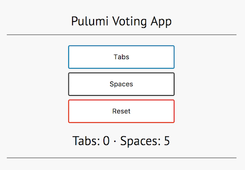

[](https://app.pulumi.com/new?template=https://github.com/pulumi/examples/blob/master/aws-ts-voting-app/README.md#gh-light-mode-only)
[](https://app.pulumi.com/new?template=https://github.com/pulumi/examples/blob/master/aws-ts-voting-app/README.md#gh-dark-mode-only)

# Voting app using Redis and Flask

A simple voting app that uses Redis for a data store and a Python Flask app for the frontend. The example has been ported from https://github.com/Azure-Samples/azure-voting-app-redis.

The example shows how easy it is to deploy containers into production and to connect them to one another. Since the example defines a custom container, Pulumi does the following:

- Builds the Docker image
- Provisions AWS Container Registry (ECR) instance
- Pushes the image to the ECR instance
- Creates a new ECS task definition, pointing to the ECR image definition

## Prerequisites

1. [Install Pulumi](https://www.pulumi.com/docs/get-started/install/)
2. [Configure AWS credentials](https://www.pulumi.com/docs/intro/cloud-providers/aws/setup/)
3. [Install Node.js](https://www.pulumi.com/docs/intro/languages/javascript/)
4. [Install Docker](https://docs.docker.com/get-docker/)

## Deploying the example

Note: some values in this example will be different from run to run. These values are indicated with `***`.

1.  Create a new stack:

    ```bash
    pulumi stack init voting-app-testing
    ```

1.  Set AWS as the provider:

    ```bash
    pulumi config set cloud:provider aws
    ```

1.  Configure Pulumi to use an AWS region that supports Fargate, which is currently only available in `us-east-1`, `us-east-2`, `us-west-2`, and `eu-west-1`:

    ```bash
    pulumi config set aws:region us-west-2
    ```

1.  Set a value for the Redis password. The value can be an encrypted secret, specified with the `--secret` flag. If this flag is not provided, the value will be saved as plaintext in `Pulumi.testing.yaml` (since `testing` is the current stack name).

    ```bash
    pulumi config set --secret redisPassword S3cr37Password
    ```

1.  Install dependencies:

    ```bash
    npm install
    ```

1.  Ensure the Docker daemon is running on your machine, then preview and deploy the program with `pulumi up`. The program deploys 24 resources and takes about 10 minutes to complete.

    ```bash
    pulumi up
    ```

1.  View the stack output properties. The stack output property `frontendURL` is the URL and port of the deployed app:

    ```bash
    pulumi stack output frontendURL
    ```

    ```
    ***.elb.us-west-2.amazonaws.com
    ```

1.  In a browser, navigate to the URL for `frontendURL`. You should see the voting app webpage.

    

## Cleaning up

When you're done, destroy your stack and remove it:

```bash
pulumi destroy
pulumi stack rm
```

## About the code

At the start of the program, the following lines retrieve the value for the Redis password by reading a [configuration value](https://www.pulumi.com/docs/reference/config/). This is the same value that was set above with the command `pulumi config set redisPassword <value>`:

```typescript
let config = new pulumi.Config();
let redisPassword = config.require("redisPassword");
```

In the program, the value can be used like any other variable.

### Resources

The program provisions two top-level resources with the following commands:

```typescript
let redisCache = new awsx.ecs.FargateService("voting-app-cache", ... )
let frontend = new awsx.ecs.FargateService("voting-app-frontend", ... )
```

The definition of `redisCache` uses the `image` property of `FargateService.taskDefinitionArgs` to point to an existing Docker image. In this case, this is the image `redis` at tag `alpine` on Docker Hub. The `redisPassword` variable is passed to the startup command for this image.

The definition of `frontend` is more interesting, as it uses `image` property of `FargateService.taskDefinitionArgs` to point to a folder with a Dockerfile, which in this case is a Python Flask app. Pulumi automatically invokes `docker build` for you and pushes the container to ECR.

So that the `frontend` container can connect to `redisCache`, the environment variables `REDIS`, `REDIS_PORT` are defined. Using the `redisListenre.endpoint` property, it's easy to declare the connection between the two containers.

The Flask app uses these environment variables to connect to the Redis cache container. See the following in [`frontend/app/main.py`](frontend/app/main.py):

```python
redis_server =   os.environ['REDIS']
redis_port =     os.environ['REDIS_PORT']
redis_password = os.environ['REDIS_PWD']
```
