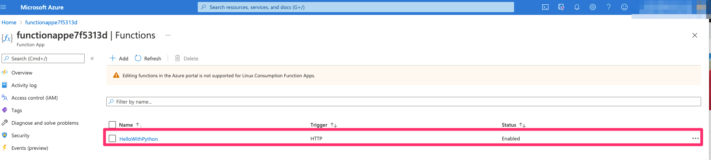

# Azure Function App Python

Use command-line tools to create a Python function that responds to HTTP requests. 
After testing the code locally, you deploy it to the serverless environment of Azure Functions.
This is informational. You can skip this entire thing if you already have working `python code`.

# Why do this step?
To make sure that you build a function that works

# Based on the following guide from MS
[Create a Python function in Azure from the command line](https://docs.microsoft.com/en-us/azure/azure-functions/create-first-function-cli-python?tabs=azure-cli%2Cbash%2Cbrowser)

## Installation Prereq

[Install the Azure Functions Core Tools](https://docs.microsoft.com/en-us/azure/azure-functions/functions-run-local?tabs=macos%2Ccsharp%2Cbash#install-the-azure-functions-core-tools)

Example steps for a mac:  

```
brew tap azure/functions
brew install azure-functions-core-tools@3
# if upgrading on a machine that has 2.x installed
brew link --overwrite azure-functions-core-tools@3
```
    
# Create a Function Project
[Create a local Functions project](https://docs.microsoft.com/en-us/azure/azure-functions/functions-run-local?tabs=macos%2Ccsharp%2Cbash#create-a-local-functions-project)

1. Create this in subdirectory of where your pulumi project is.  For Example.
   ```
     cd azure-function-workshop (where the Pulumi.yaml, **`__main__.py`**, etc are located. )
     mkdir app
     cd app

   ```

1. Create an Azure Functions project
   In the terminal window or from a command prompt, navigate to an empty folder for your project, and run the following command:
    ```
    func init
    ```
    You will also be prompted to choose a runtime for the project. Select **python**.

1. Select a worker runtime
   ```
   Select a number for worker runtime:
    1. dotnet
    2. dotnet (isolated process)
    3. node
    4. python
    5. java
    6. powershell
    7. custom
    Choose option: 4
   ```
   Choose option: **4. python**

   Output:

   ```
   python
    Found Python version 3.7.3 (python3).
    Writing requirements.txt
    Writing .gitignore
    Writing host.json
    Writing local.settings.json
   ```

1. [Create a function](https://docs.microsoft.com/en-us/azure/azure-functions/functions-run-local?tabs=macos%2Ccsharp%2Cbash#create-func).
   To create a function, run the following command:

    ```
     func new
    ```

    You will also be prompted to choose a runtime for the project. Select **9. HTTP trigger**.

    ```
    Select a number for template:
    1. Azure Blob Storage trigger
    2. Azure Cosmos DB trigger
    3. Durable Functions activity
    4. Durable Functions entity
    5. Durable Functions HTTP starter
    6. Durable Functions orchestrator
    7. Azure Event Grid trigger
    8. Azure Event Hub trigger
    9. HTTP trigger
    10. Azure Queue Storage trigger
    11. RabbitMQ trigger
    12. Azure Service Bus Queue trigger
    13. Azure Service Bus Topic trigger
    14. Timer trigger
    
   ```
    **Choose option: 9**

    Next you will have to name your function.  The default name is: `HttpTrigger`.  
    Here we entered **HelloWorld**  

    
    `HTTP trigger`

    `Function name: [HttpTrigger]` **HelloWorld**

    Output:

    ```
    The function "HelloWorld" was created successfully from the "HTTP trigger" template.
    ```

1. Verify that the function and all the files were created.

   `azure-function-workshop/app#> ls`

   ```
    HelloWorld(This is a directory)  host.json  local.settings.json  requirements.txt
   ```

   `cd HelloWorld`

   `azure-function-workshop/app/HelloWorld#>ls -a`
   
   ```
      __init__.py  function.json
   ```

1. Change the `anonymous` user in the **`function.json`** 
   
   This is because `Unless the HTTP access level on an HTTP triggered function is set to anonymous, requests must include an API access key in the request` as per
   [Function access keys](https://docs.microsoft.com/en-us/azure/azure-functions/security-concepts#function-access-keys).
   
   Before: 
   ```
   "authLevel": "function",

   ```
   
   After
   ```
   "authLevel": "anonymous",

   ```

1. Update the **`__init__.py__`** (Optional)
   This the file where your python code that you want.  
   You can keep what you have.  We changed ours to simplify the output to
   ```
     import logging
     import azure.functions as func

     def main(req: func.HttpRequest) -> func.HttpResponse:
         logging.info('Python HTTP trigger function processed a request.')
         return func.HttpResponse(f"Hello from Python in Pulumi! You have stood up a serverless function in Azure!")
   ```


## Deploy your code to Azure via azure cli

1. You need the function name.  The name doesn't exist yet
   because you haven't created it.

1. comment out the following line in `__main__.py__` from your code from the section where the **web.WebApp** is:

   ```
   app = web.WebApp("functionapp", 
   ...
   ...
      #web.NameValuePairArgs(name=  "WEBSITE_RUN_FROM_PACKAGE", value="https://github.com/..."   <- THIS IS THE LINE TO COMMENT OUT
   ..
   ..
      )
   ``` 

1. Deploy the Pulumi stack via `pulumi up -y`

1. Find the function name via `pulumi stack output` or via checking the azure console

1. To publish your Functions project into Azure, enter the following command:

   `azure-function-workshop/app#> func azure functionapp publish` **functionappe7f5313d**

1. Check the azure console and view that the python code shows up inside he.

   
   
## Clean Up
1. Azure does not allow you edit/delete python functions via the console.  
   Destroy the stack:  `pulumi destroy -y` 

1. Update the ```__main__.py``` to external URL.   
   ```
   app = web.WebApp("functionapp", 
   ...
   ...
      web.NameValuePairArgs(name=  "WEBSITE_RUN_FROM_PACKAGE", value="https://github.com/..."   <- PUT THIS BACK IN
   ..
   ..
      )
   ``` 
1. Return back to your original steps to continue.