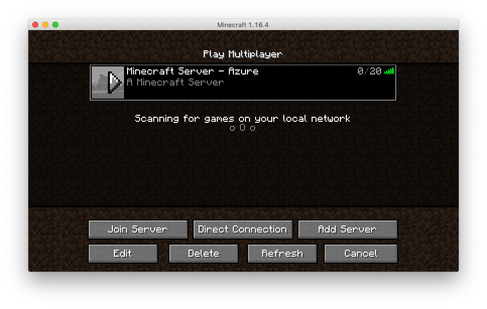

[](https://app.pulumi.com/new?template=https://github.com/pulumi/examples/blob/master/azure-py-minecraft-server/README.md#gh-light-mode-only)
[](https://app.pulumi.com/new?template=https://github.com/pulumi/examples/blob/master/azure-py-minecraft-server/README.md#gh-dark-mode-only)

# Minecraft Server Using an Azure Virtual Machine

This example deploys an Azure Virtual Machine and provisions a Minecraft server.

## Prerequisites

1. [Install Pulumi](https://www.pulumi.com/docs/get-started/install/)
1. [Configure Pulumi for Azure](https://www.pulumi.com/docs/intro/cloud-providers/azure/setup/)
1. [Configure Pulumi for Python](https://www.pulumi.com/docs/intro/languages/python/)

## Deploying and running the program

1. Create a new stack:

    ```bash
    $ pulumi stack init dev
    ```

1. Create a Python virtualenv, activate it, and install dependencies:

   This installs the dependent packages [needed](https://www.pulumi.com/docs/intro/concepts/how-pulumi-works/) for our Pulumi program.

    ```bash
    $ python3 -m venv venv
    $ source venv/bin/activate
    $ pip3 install -r requirements.txt
    ```

1. Next, generate an OpenSSH keypair for use with your server.

    ```bash
    $ ssh-keygen -t rsa -f rsa -b 4096 -m PEM
    ```

    This will output two files, `rsa` and `rsa.pub`, in the current directory. Be sure not to commit these files!

    We must configure our stack and make the public key and private available to the virtual machine. The private key is used for subsequent SCP and SSH steps that will configure our server after it is stood up.

    ```bash
    $ cat rsa.pub | pulumi config set publicKey --
    $ cat rsa | pulumi config set privateKey --secret --
    ```

    Notice that we've used `--secret` for `privateKey`. This ensures the private key is stored as an encrypted [Pulumi secret](https://www.pulumi.com/docs/intro/concepts/secrets/).

1. Set the required configuration for this example. This example requires you to supply a username, password, location, and the public and private keys to the virtual machine that we are going to create. Check the Azure virtual machine [password requirements](https://docs.microsoft.com/en-us/azure/virtual-machines/linux/faq#what-are-the-password-requirements-when-creating-a-vm) before creating a password.

    ```bash
    $ pulumi config set admin_password --secret <admin password>
    $ pulumi config set admin_username <admin username>
    $ pulumi config set azure-native:location westus # any valid Azure region will do
    ```

    Note that `--secret` ensures your password is encrypted safely.


1. Run `pulumi up` to preview and deploy the changes:

    ```bash
    $ pulumi up
    Previewing update (dev)

    View Live: https://app.pulumi.com/spara/azure-py-webserver/dev/previews/19ff86d5-9303-4f53-a1ae-d0882a59e9a9

        Type                                              Name                    Plan
    +   pulumi:pulumi:Stack                               azure-py-webserver-dev  create
    +   ├─ azure-native:resources:ResourceGroup           server-rg               create
    +   ├─ azure-native:network:PublicIPAddress           server-ip               create
    +   ├─ azure-native:network:VirtualNetwork            server-network          create
    +   ├─ azure-native:network:NetworkInterface          server-nic              create
    +   ├─ azure-native:compute:VirtualMachine            server-vm               create
    +   ├─ pulumi-python:dynamic:Resource                 config                  create
    +   └─ pulumi-python:dynamic:Resource                 install                 create

    Resources:
        + 8 to create

    Do you want to perform this update? yes
    Updating (dev)

    View Live: https://app.pulumi.com/spara/azure-py-webserver/dev/updates/40

        Type                                              Name                    Status      Info
    +   pulumi:pulumi:Stack                               azure-py-webserver-dev  created     1 message
    +   ├─ azure-native:resources:ResourceGroup           server-rg               created
    +   ├─ azure-native:network:VirtualNetwork            server-network          created
    +   ├─ azure-native:network:PublicIPAddress           server-ip               created
    +   ├─ azure-native:network:NetworkInterface          server-nic              created
    +   ├─ azure-native:compute:VirtualMachine            server-vm               created
    +   ├─ pulumi-python:dynamic:Resource                 config                  created
    +   └─ pulumi-python:dynamic:Resource                 install                 created

    Diagnostics:

    Outputs:
    Minecraft Server IP Address: "40.112.182.143"

    Resources:
        + 8 created

    Duration: 7m6s
    ```

1. Get the IP address of the newly-created instance from the stack's outputs:

    ```bash
    $ pulumi stack output public_ip
    40.112.182.143
    ```

1. Check to see that your server is running by adding the server to the Minecraft client.

    

1. Destroy the stack:

    ```bash
    $ pulumi destroy
    Previewing destroy (dev)

    View Live: https://app.pulumi.com/spara/azure-py-webserver/dev/previews/2544442c-ddd7-44cc-a633-2a5fed28dafb

        Type                                              Name                    Plan
    -   pulumi:pulumi:Stack                               azure-py-webserver-dev  delete
    -   ├─ pulumi-python:dynamic:Resource                 install                 delete
    -   ├─ pulumi-python:dynamic:Resource                 config                  delete
    -   ├─ azure-native:compute:VirtualMachine            server-vm               delete
    -   ├─ azure-native:network:NetworkInterface          server-nic              delete
    -   ├─ azure-native:network:PublicIPAddress           server-ip               delete
    -   ├─ azure-native:network:VirtualNetwork            server-network          delete
    -   └─ azure-native:resources:ResourceGroup           server-rg               delete

    Outputs:
    - Minecraft Server IP Address: "40.112.182.143"

    Resources:
        - 8 to delete

    Do you want to perform this destroy? yes
    Destroying (dev)

    View Live: https://app.pulumi.com/spara/azure-py-webserver/dev/updates/41

        Type                                              Name                    Status
    -   pulumi:pulumi:Stack                               azure-py-webserver-dev  deleted
    -   ├─ pulumi-python:dynamic:Resource                 install                 deleted
    -   ├─ pulumi-python:dynamic:Resource                 config                  deleted
    -   ├─ azure-native:compute:VirtualMachine            server-vm               deleted
    -   ├─ azure-native:network:NetworkInterface          server-nic              deleted
    -   ├─ azure-native:network:PublicIPAddress           server-ip               deleted
    -   ├─ azure-native:network:VirtualNetwork            server-network          deleted
    -   └─ azure-native:resources:ResourceGroup           server-rg               deleted

    Outputs:
    - Minecraft Server IP Address: "40.112.182.143"

    Resources:
        - 8 deleted

    Duration: 4m33s
    ```
