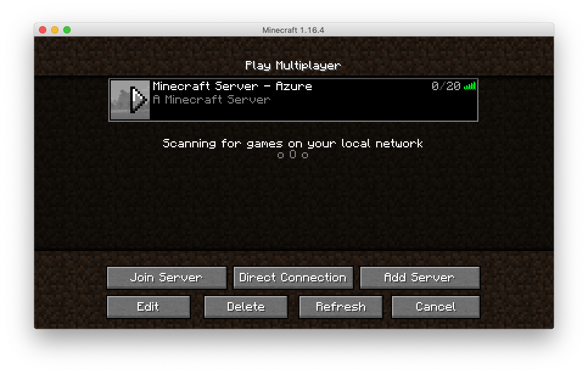

[](https://app.pulumi.com/new?template=https://github.com/pulumi/examples/blob/master/azure-py-minecraft-server/README.md#gh-light-mode-only)
[](https://app.pulumi.com/new?template=https://github.com/pulumi/examples/blob/master/azure-py-minecraft-server/README.md#gh-dark-mode-only)

# Minecraft server using an Azure Virtual Machine

This example deploys an Azure Virtual Machine and provisions a Minecraft server.

## Prerequisites

1. [Install Pulumi](https://www.pulumi.com/docs/get-started/install/)
2. [Configure Azure credentials](https://www.pulumi.com/docs/intro/cloud-providers/azure/setup/)
3. [Install Python](https://www.pulumi.com/docs/intro/languages/python/)

## Deploying the example

1. Create a new stack:

    ```bash
    pulumi stack init dev
    ```

1. Install dependencies:

    ```bash
    python3 -m venv venv
    source venv/bin/activate
    pip install -r requirements.txt
    ```

1. Generate an OpenSSH keypair for use with your server:

    ```bash
    ssh-keygen -t rsa -f rsa -b 4096 -m PEM
    ```

    This will output two files, `rsa` and `rsa.pub`, in the current directory. Be sure not to commit these files!

    Make the public and private keys available to the virtual machine. The private key is used for subsequent SCP and SSH steps that will configure your server after it is stood up. Notice that we've used `--secret` for `privateKey`. This ensures the private key is stored as an encrypted [Pulumi secret](https://www.pulumi.com/docs/intro/concepts/secrets/).

    ```bash
    cat rsa.pub | pulumi config set publicKey --
    cat rsa | pulumi config set privateKey --secret --
    ```

1. Set the required configuration for this example. This example requires you to supply a username, password, and location for the virtual machine that we are going to create. Check the Azure virtual machine [password requirements](https://docs.microsoft.com/en-us/azure/virtual-machines/linux/faq#what-are-the-password-requirements-when-creating-a-vm) before creating a password. Note that `--secret` ensures your password is encrypted safely.

    ```bash
    pulumi config set admin_password --secret <admin password>
    pulumi config set admin_username <admin username>
    pulumi config set azure-native:location westus    # any valid Azure region will do
    ```

1. Deploy the stack:

    ```bash
    pulumi up
    ```

    ```
        Type                                              Name                    Status
    +   pulumi:pulumi:Stack                               azure-py-webserver-dev  created
    +   ├─ azure-native:resources:ResourceGroup           server-rg               created
    +   ├─ azure-native:network:VirtualNetwork            server-network          created
    +   ├─ azure-native:network:PublicIPAddress           server-ip               created
    +   ├─ azure-native:network:NetworkInterface          server-nic              created
    +   ├─ azure-native:compute:VirtualMachine            server-vm               created
    +   ├─ pulumi-python:dynamic:Resource                 config                  created
    +   └─ pulumi-python:dynamic:Resource                 install                 created

    Outputs:
    Minecraft Server IP Address: "40.112.182.143"

    Resources:
        + 8 created

    Duration: 7m6s
    ```

1. Get the IP address of the newly-created instance from the stack's outputs:

    ```bash
    pulumi stack output public_ip
    ```

1. Check to see that your server is running by adding the server to the Minecraft client.

    

## Cleaning up

Once you are finished, you can destroy your stack and remove it to avoid incurring any additional cost:

```bash
pulumi destroy
pulumi stack rm
```
