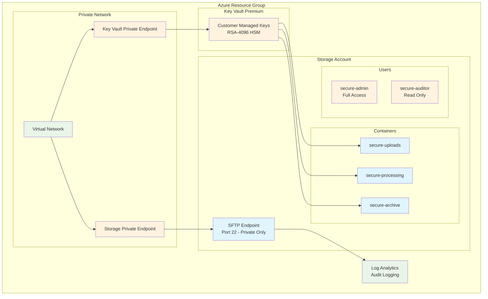

# Azure SFTP Blob Storage with Pulumi YAML

A production-ready Azure infrastructure for secure file transfer using SFTP protocol. This example creates an Azure Storage Account with hierarchical namespace, SFTP support, customer-managed encryption, and private network access.

## Architecture



## Features

- **🔐 Customer-Managed Keys**: HSM-backed encryption in Azure Key Vault Premium
- **🏠 Private Network Only**: No public internet access, VPN/ExpressRoute required
- **📁 Multiple Containers**: Organized storage with role-based access
- **👥 User Management**: Admin and auditor roles with SSH key authentication
- **📊 Infrastructure Encryption**: Double encryption for maximum security
- **🔒 Immutable Storage**: Write-once, read-many for data integrity
- **📋 Audit Logging**: Comprehensive access logging and monitoring

## Quick Start

1. **Clone and setup**
   ```bash
   git clone <repository-url>
   cd azure-yaml-sftp-blob
   pulumi stack init dev
   ```

2. **Configure required settings**
   ```bash
   # Set Azure region
   pulumi config set azure-native:location "East US 2"

   # Set unique storage account name
   pulumi config set storageAccountName "mysftpstorage$(date +%s)"

   # Add SSH public key (required)
   pulumi config set userPublicKey "$(cat ~/.ssh/id_rsa.pub)"
   ```

3. **Deploy**
   ```bash
   pulumi up
   ```

4. **Connect (requires private network)**
   ```bash
   # Get endpoint (private IP only)
   ENDPOINT=$(pulumi stack output sftpEndpoint)

   # Connect via SFTP (from private network)
   sftp secure-admin@$ENDPOINT
   ```

## Configuration

| Parameter | Description | Default |
|-----------|-------------|---------|
| `azure-native:location` | Azure deployment region | East US 2 |
| `storageAccountName` | Unique storage account name | secure{stack}{randomId} |
| `userPublicKey` | SSH public key for authentication | (required) |
| `keyVaultName` | Key Vault name | secure-kv-{stack} |
| `enableCustomerManagedKeys` | Enable CMK encryption | true |

## User Access

### secure-admin
- **Permissions**: Full access to all containers
- **Use Case**: File management and administration

### secure-auditor
- **Permissions**: Read-only access to processing and archive
- **Use Case**: Auditing and compliance verification

## Security Features

- **Customer-Managed Encryption**: 4096-bit RSA keys in HSM
- **Infrastructure Encryption**: Double encryption layer
- **Private Network Access**: No public endpoints
- **SSH Keys Only**: Password authentication disabled
- **Immutable Containers**: Prevent data tampering
- **Extended Audit Logs**: Comprehensive access logging

## Convert to Other Languages

```bash
# TypeScript
pulumi convert --language typescript --out ./typescript-version

# Python
pulumi convert --language python --out ./python-version

# Go
pulumi convert --language go --out ./go-version

# C#
pulumi convert --language csharp --out ./csharp-version
```

## Network Requirements

This infrastructure requires private network access:

- **VPN Connection**: Site-to-site or point-to-site VPN
- **ExpressRoute**: Dedicated private connection to Azure
- **Azure Bastion**: Jump box access within Azure

## Healthcare & Compliance

For healthcare organizations requiring HIPAA compliance, see [HIPAA_COMPLIANCE.md](./HIPAA_COMPLIANCE.md) for additional guidance and security considerations.

**Important**: While this example implements enterprise security controls, compliance with specific regulations requires professional validation by your legal and compliance teams.

## Troubleshooting

### Common Issues

1. **Storage account name conflicts**
   ```bash
   pulumi config set storageAccountName "unique-name-$(date +%s)"
   ```

2. **SSH key format issues**
   ```bash
   # Verify key format
   ssh-keygen -l -f ~/.ssh/id_rsa.pub
   ```

3. **Private network connectivity**
   ```bash
   # Verify private endpoint resolution
   nslookup $(pulumi stack output sftpEndpoint)
   # Should resolve to private IP (10.x.x.x)
   ```

## Clean Up

```bash
pulumi destroy
```

**Warning**: This permanently deletes all data. Ensure backups if needed.

## Support

- [Azure Storage SFTP Documentation](https://docs.microsoft.com/en-us/azure/storage/blobs/secure-file-transfer-protocol-support)
- [Pulumi Azure Native Provider](https://www.pulumi.com/registry/packages/azure-native/)
- For compliance guidance, see [HIPAA_COMPLIANCE.md](./HIPAA_COMPLIANCE.md)