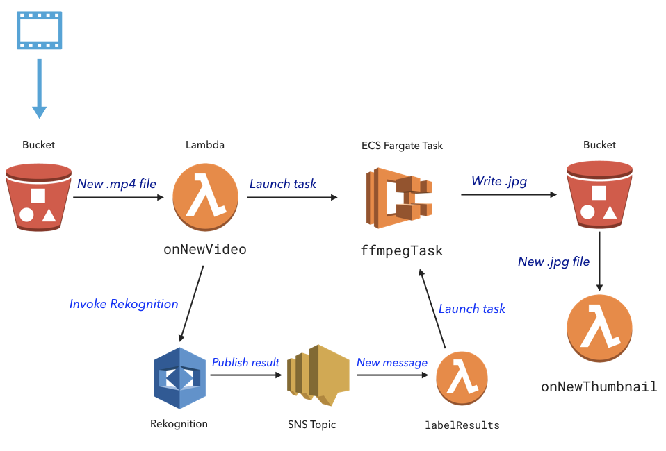

[](https://app.pulumi.com/new?template=https://github.com/pulumi/examples/blob/master/cloud-js-thumbnailer-machine-learning/README.md#gh-light-mode-only)
[](https://app.pulumi.com/new?template=https://github.com/pulumi/examples/blob/master/cloud-js-thumbnailer-machine-learning/README.md#gh-dark-mode-only)

# Video Thumbnailer with AWS Rekognition

A video thumbnail extractor using serverless functions, containers, and [AWS Rekognition](https://aws.amazon.com/rekognition/). This is an extension of the sample [cloud-js-thumbnailer](../cloud-js-thumbnailer). When a new video is uploaded to S3, this sample calls AWS Rekognition to find a frame with the highest confidence for the label "cat" and extracts a jpg of this frame, by running ffmpeg in an AWS Fargate container.



## Prerequisites

To use this example, make sure [Docker](https://docs.docker.com/engine/installation/) is installed and running.

## Running the App

Note: some values in this example will be different from run to run.  These values are indicated
with `***`.

1.  Create a new stack:

    ```
    $ pulumi stack init thumbnailer-rekognition
    ```

1.  Configure Pulumi to use AWS Fargate, which is currently only available in `us-east-1`, `us-west-2`, and `eu-west-1`:

    ```
    $ pulumi config set aws:region us-west-2
    $ pulumi config set cloud-aws:useFargate true
    ```

1.  Configure the Lambda function role so that it can access Rekognition:

    ```
    $ pulumi config set cloud-aws:computeIAMRolePolicyARNs arn:aws:iam::aws:policy/AWSLambdaExecute,arn:aws:iam::aws:policy/AWSLambda_FullAccess,arn:aws:iam::aws:policy/AmazonECS_FullAccess,arn:aws:iam::aws:policy/AmazonRekognitionFullAccess,arn:aws:iam::aws:policy/IAMFullAccess
    ```

1.  Restore NPM modules via `npm install` or `yarn install`.

1.  Preview and deploy the app via `pulumi up`. The preview will take some time, as it builds a Docker container. A total of 54 resources are created.

    ```
    $ pulumi up
    Previewing update (thumbnailer-rekognition)

    View Live: https://app.pulumi.com/***

        Type                                  Name                                   Plan
    +   pulumi:pulumi:Stack                   video-thumbnailer-rekognition-rek-dev  create...
    +   ├─ cloud:topic:Topic                  AmazonRekognitionTopic                 create
    +   │  ├─ aws:sns:TopicEventSubscription  AmazonRekognitionTopic_labelResults    create
    +   │  ├─ aws:iam:Role                    AmazonRekognitionTopic_labelResults    create
    +   │  └─ aws:sns:Topic                   AmazonRekognitionTopic                 create
    +   │  └─ aws:iam:RolePolicyAttachment    AmazonRekognitionTopic_labelResults-b5aeb6b6  create..
    +   │  └─ aws:iam:RolePolicyAttachment    AmazonRekognitionTopic_labelResults-0cbb1731  create..
    +   │  └─ aws:iam:RolePolicyAttachment    AmazonRekognitionTopic_labelResults-4aaabb8e  create..
    +   │  └─ aws:iam:RolePolicyAttachment    AmazonRekognitionTopic_labelResults-2d3346de  create..
    +   │  └─ aws:iam:RolePolicyAttachment    AmazonRekognitionTopic_labelResults-2d3346de  create
    +   │  ├─ aws:iam:Role                    pulumi-rek-dev-execution                      create
    +   │  ├─ aws:iam:Role                    pulumi-rek-dev-task                           create
    +   │  ├─ aws:iam:RolePolicyAttachment    pulumi-rek-dev-execution                      create
    +   │  ├─ aws:iam:RolePolicyAttachment    pulumi-rek-task-0cbb1731                      create
    +   │  ├─ aws:iam:RolePolicyAttachment    pulumi-rek-task-2d3346de                      create
    +   │  ├─ aws:iam:RolePolicyAttachment    pulumi-rek-task-b5aeb6b6                      create
    +   │  └─ aws:iam:RolePolicyAttachment    pulumi-rek-task-4aaabb8e                      create
    +   ├─ awsx:cluster:Cluster               pulumi-rek-dev-global                         create
    +   │  └─ aws:ecs:Cluster                 pulumi-rek-dev-global                         create
    +   ├─ cloud:bucket:Bucket                bucket                                        create
    +   │  ├─ aws:s3:BucketEventSubscription  onNewVideo                                    create
    +   pulumi:pulumi:Stack                   video-thumbnailer-rekognition-rek-dev         create
    +   │  │  └─ aws:lambda:Permission        onNewVideo                                    create
    +   │  │  └─ aws:lambda:Permission        onNewVideo                                    create
    +   │  │  └─ aws:lambda:Permission        onNewVideo                                    create
    +   │  │  └─ aws:lambda:Permission        onNewVideo                                    create
    +   │  │  └─ aws:lambda:Permission        AmazonRekognitionTopic_labelResults           create
    +   pulumi:pulumi:Stack                   video-thumbnailer-rekognition-rek-dev         create
    +   │  ├─ aws:iam:Role                    onNewThumbnail                                create
    +   │  ├─ aws:iam:Role                    onNewVideo                                    create
    +   │  ├─ aws:s3:Bucket                   bucket                                        create
    +   │  │  └─ aws:s3:BucketNotification    onNewVideo                                    create
    +   │  ├─ aws:iam:RolePolicyAttachment    onNewThumbnail-0cbb1731                       create
    +   │  ├─ aws:iam:RolePolicyAttachment    onNewThumbnail-b5aeb6b6                       create
    +   │  ├─ aws:iam:RolePolicyAttachment    onNewThumbnail-2d3346de                       create
    +   │  ├─ aws:iam:RolePolicyAttachment    onNewThumbnail-4aaabb8e                       create
    +   │  ├─ aws:iam:RolePolicyAttachment    onNewVideo-4aaabb8e                           create
    +   │  ├─ aws:iam:RolePolicyAttachment    onNewVideo-b5aeb6b6                           create
    +   │  ├─ aws:iam:RolePolicyAttachment    onNewVideo-0cbb1731                           create
    +   │  ├─ aws:iam:RolePolicyAttachment    onNewVideo-2d3346de                           create
    +   │  ├─ aws:lambda:Function             onNewThumbnail                                create
    +   │  └─ aws:lambda:Function             onNewVideo                                    create
    +   ├─ cloud:task:Task                    ffmpegThumbTask                               create
    +   │  ├─ aws:cloudwatch:LogGroup         ffmpegThumbTask                               create
    +   │  └─ aws:ecs:TaskDefinition          ffmpegThumbTask                               create
    +   ├─ aws:ecr:Repository                 pulum-dc8d99de-container                      create
    +   ├─ aws:iam:Role                       rekognition-role                              create
    +   ├─ aws:iam:RolePolicyAttachment       rekognition-access                            create
    +   ├─ aws:ecr:LifecyclePolicy            pulum-dc8d99de-container                      create
    +   └─ awsx:network:Network               default-vpc                                   create

    Resources:
    + 54 to create
    ```

1.  Upload a video:

    ```
    $ aws s3 cp ./sample/cat.mp4 s3://$(pulumi stack output bucketName)
    upload: sample/cat.mp4 to s3://***/cat.mp4
    ```

1.  View the logs from both the Lambda function and the ECS task:

    ```
    $ pulumi logs -f
    Collecting logs for stack pulumi/donna-thumbnailer-rekognition since 2018-05-21T18:57:11.000-07:00.
    2018-05-21T19:57:35.968-07:00[                    onNewVideo] *** New video: file cat.mp4 was uploaded at 2018-05-22T02:57:35.431Z.
    2018-05-21T19:57:36.376-07:00[                    onNewVideo] *** Submitted Rekognition job for cat.mp4
    2018-05-21T19:57:45.848-07:00[AmazonRekognitionTopic_labelRe] *** Rekognition job complete
    2018-05-21T19:57:50.690-07:00[AmazonRekognitionTopic_labelRe] Raw label results:
    ...
    2018-05-21T19:57:50.746-07:00[AmazonRekognitionTopic_labelRe]     *** Found object Cat at position 1568.  Confidence = 50.56669616699219
    2018-05-21T19:57:50.746-07:00[AmazonRekognitionTopic_labelRe] *** Rekognition processing complete for bucket-d6c6339/cat.mp4 at timestamp 1.568
    2018-05-21T19:57:51.762-07:00[AmazonRekognitionTopic_labelRe] *** Launched thumbnailer task.
    2018-05-21T19:58:55.197-07:00[               ffmpegThumbTask] Starting ffmpeg task...
    2018-05-21T19:58:55.216-07:00[               ffmpegThumbTask] Copying from S3 bucket-d6c6339/cat.mp4 to cat.mp4 ...
    download: s3://bucket-d6c6339/cat.mp4 to ./cat.mp4                pleted 256.0 KiB/756.1 KiB (2.4 MiB/s) with 1 file(s) remaining
    2018-05-21T19:59:02.244-07:00[               ffmpegThumbTask] Copying .jpg to S3 at bucket-d6c6339/.jpg ...
    upload: ./.jpg to s3://bucket-d6c6339/output/.jpg                 pleted 87.3 KiB/87.3 KiB (428.8 KiB/s) with 1 file(s) remaining
    2018-05-21T19:59:05.778-07:00[                onNewThumbnail] *** New thumbnail: file cat.jpg was saved at 2018-05-22T02:59:04.858Z.
        ```

1.  Download the key frame:

    ```
    $ aws s3 cp s3://$(pulumi stack output bucketName)/cat.jpg .
    download: s3://***/cat.jpg to ./cat.jpg
    ```

## Clean up

To clean up resources, run `pulumi destroy` and answer the confirmation question at the prompt.
