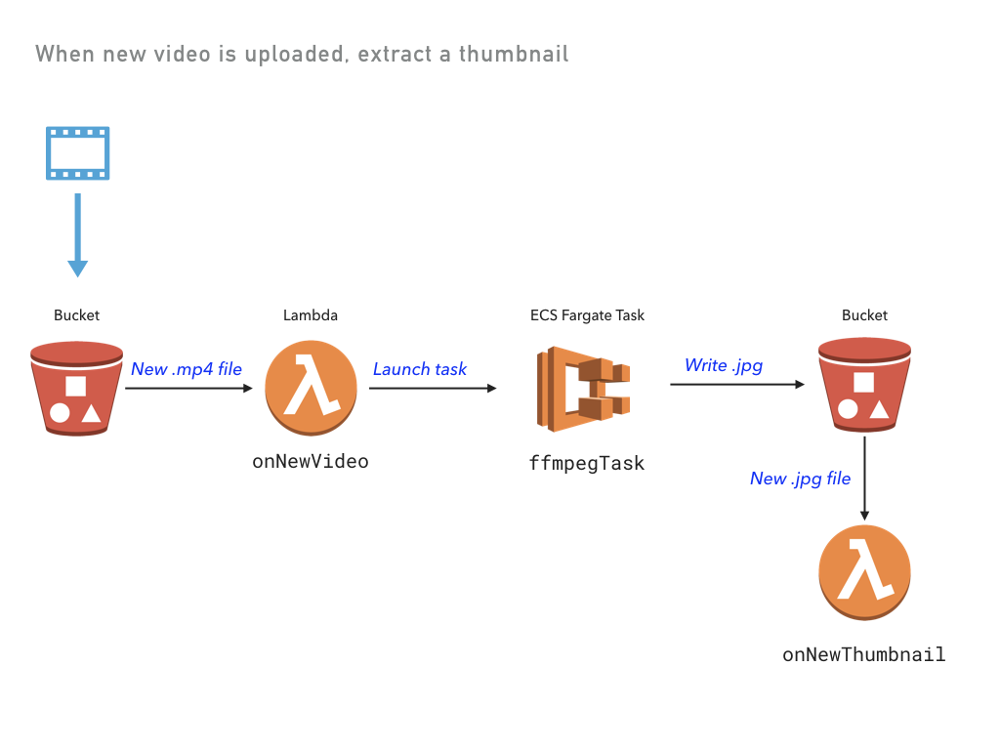

# Video Thumbnailer

A video thumbnail extractor using serverless functions and containers.

Loosely derived from the example at https://serverless.com/blog/serverless-application-for-long-running-process-fargate-lambda/.



## Prerequisites

To run this example, make sure [Docker](https://docs.docker.com/engine/installation/) is installed and running.

## Running the App

1.  Create a new stack:

    ```
    $ pulumi stack init thumbnailer-testing
    ```

1.  Configure Pulumi to use AWS Fargate, which is currently only available in `us-east-1`, `us-east-2`, `us-west-2`, and `eu-west-1`:

    ```
    $ pulumi config set aws:region us-west-2
    $ pulumi config set cloud-aws:useFargate true
    ```    

1.  Restore NPM modules via `npm install`.

1.  Preview and deploy the app via `pulumi update`. The preview will take some time, as it builds a Docker container. A total of 32 resources are created.

    ```
    $ pulumi update
    Previewing update of stack 'thumbnailer-testing'
    Previewing changes:

        Type                                Name                                   Plan          Info
    *   global                              global                                 no change     1 info message. info: Building container image 'pulum-
    +   pulumi:pulumi:Stack                       video-thumbnailer-thumbnailer-testing  create...     1 info message. info: Successfully tagged pulum-
    ...

    Do you want to perform this update? yes
    Updating stack 'thumbnailer-testing'
    Performing changes:

        Type                                Name                                   Status        Info
    *   global                              global                                 unchanged     1 info message. info: Building container image 'pulum-
    +   pulumi:pulumi:Stack                 video-thumbnailer-thumbnailer-testing  created      1 info message. info: 081c66fa4b0c: Pushed
    +   ├─ cloud:bucket:Bucket              bucket                                 created
    +   │  ├─ cloud:function:Function             onNewVideo                             created
    +   │  │  └─ aws:serverless:Function          onNewVideo                             created
    +   │  │  └─ aws:serverless:Function          onNewVideo                             created
    +   │  │  └─ aws:serverless:Function          onNewVideo                             created
    +   │  │  └─ aws:serverless:Function          onNewVideo                             created
    +   │  ├─ cloud:function:Function             onNewThumbnail                         created
    +   │  │  └─ aws:serverless:Function          onNewThumbnail                         created
    +   │  │  └─ aws:serverless:Function          onNewThumbnail                         created
    +   │  │     └─ aws:lambda:Function           onNewVideo                             created
    +   │  │  └─ aws:serverless:Function          onNewThumbnail                         created
    +   │  │  └─ aws:serverless:Function          onNewThumbnail                         created
    +   │  │     └─ aws:lambda:Function           onNewThumbnail                         created
    +   │  ├─ aws:s3:Bucket                       bucket                                 created
    +   │  ├─ aws:lambda:Permission               onNewThumbnail                         created
    +   │  ├─ aws:lambda:Permission               onNewVideo                             created
    +   │  └─ aws:s3:BucketNotification           bucket                                 created
    +   ├─ aws-infra:network:Network              default-vpc                            created
    +   ├─ aws:ecr:Repository                     pulum-dc8d99de-container               created
    +   ├─ cloud:global:infrastructure            global-infrastructure                  created
    +   │  ├─ aws:iam:Role                        pulumi-thumbnailer--task               created
    +   │  ├─ aws:iam:Role                        pulumi-thumbna-execution               created
    +   │  ├─ aws:iam:RolePolicyAttachment        pulumi-thu-task-32be53a2               created
    +   │  ├─ aws:iam:RolePolicyAttachment        pulumi-thu-task-fd1a00e5               created
    +   │  └─ aws:iam:RolePolicyAttachment        pulumi-thumbna-execution               created
    +   ├─ cloud:task:Task                        ffmpegThumbTask                        created
    +   │  ├─ aws:cloudwatch:LogGroup             ffmpegThumbTask                        created
    +   │  └─ aws:ecs:TaskDefinition              ffmpegThumbTask                        created
    +   └─ aws-infra:cluster:Cluster              pulumi-thumbnaile-global               created
    +      ├─ aws:ecs:Cluster                     pulumi-thumbnaile-global               created
    +      └─ aws:ec2:SecurityGroup               pulumi-thumbnaile-global               created
    ...

    ---outputs:---
    bucketName: "bucket-c647dfb"

    info: 32 changes performed:
        + 32 resources created
    Update duration: 1m32.73050186s

    Permalink: https://pulumi.com/lindydonna/thumbnailer-testing/updates/1
    ```

1.  View the stack outputs:

    ```
    $ pulumi stack output
    Current stack outputs (1):
        OUTPUT                                           VALUE
        bucketName                                       bucket-6120251
    ```

1.  Upload a video, embedding the timestamp in the filename:

    ```
    $ aws s3 cp ./sample/cat.mp4 s3://$(pulumi stack output bucketName)/cat_00-01.mp4
    upload: sample/cat.mp4 to s3://bucket-c647dfb/cat_00-01.mp4
    ```

1.  View the logs from both the Lambda function and the ECS task:

    ```
    2018-05-19T20:07:43.879-07:00[                    onNewVideo] *** New video: file cat_00-01.mp4 was uploaded at 2018-05-20T03:07:42.477Z.
    2018-05-19T20:07:43.880-07:00[                    onNewVideo] Running thumbnailer task.
    2018-05-19T20:08:54.229-07:00[               ffmpegThumbTask] Starting...
    2018-05-19T20:08:54.271-07:00[               ffmpegThumbTask] Copying from S3 bucket-c647dfb/cat_00-01.mp4 to cat_00-01.mp4 ...
    download: s3://bucket-c647dfb/cat_00-01.mp4 to ./cat_00-01.mp4      eted 256.0 KiB/666.5 KiB (840.9 KiB/s) with 1 file(s) remaining
    2018-05-19T20:08:59.687-07:00[               ffmpegThumbTask] Copying cat.jpg to S3 at bucket-c647dfb/cat.jpg ...
    upload: ./cat.jpg to s3://bucket-c647dfb/cat.jpg                ompleted 86.6 KiB/86.6 KiB (1.0 MiB/s) with 1 file(s) remaining
    2018-05-19T20:09:02.289-07:00[                onNewThumbnail] *** New thumbnail: file cat.jpg was saved at 2018-05-20T03:09:02.162Z.
    ```

1.  Download the key frame:

    ```
    $ aws s3 cp s3://$(pulumi stack output bucketName)/cat.jpg .
    download: s3://bucket-0e25c2d/cat.jpg to ./cat.jpg            
    ```

## Clean up

To clean up resources, run `pulumi destroy` and answer the confirmation question at the prompt.
