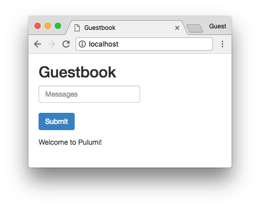

[](https://app.pulumi.com/new?template=https://github.com/pulumi/examples/blob/master/kubernetes-cs-guestbook/components/README.md#gh-light-mode-only)
[](https://app.pulumi.com/new?template=https://github.com/pulumi/examples/blob/master/kubernetes-cs-guestbook/components/README.md#gh-dark-mode-only)

# Kubernetes Guestbook (components variant)

A version of the [Kubernetes Guestbook](https://kubernetes.io/docs/tutorials/stateless-application/guestbook/)
application using Pulumi.

## Prerequisites

1. [Install Pulumi](https://www.pulumi.com/docs/get-started/install/)
2. [Configure Kubernetes](https://www.pulumi.com/docs/intro/cloud-providers/kubernetes/setup/)
3. [Install .NET](https://www.pulumi.com/docs/intro/languages/dotnet/)

## Deploying the example

1.  Create a new stack:

    ```bash
    pulumi stack init testbook
    ```

1.  This example will attempt to expose the guestbook application to the Internet with a `Service`
    of type `LoadBalancer`. Since minikube does not support `LoadBalancer`, the guestbook
    application already knows to use type `ClusterIP` instead; all you need to do is to tell it
    whether you're deploying to minikube:

    ```bash
    pulumi config set isMinikube <value>
    ```

1.  Deploy the stack:

    ```bash
    pulumi up
    ```

    ```
    Updating stack 'testbook'
    Performing changes:

         Type                           Name                       Status
     +   pulumi:pulumi:Stack            guestbook-csharp-testbook  created
     +   ├─ kubernetes:apps:Deployment  redis-replica              created
     +   ├─ kubernetes:apps:Deployment  frontend                   created
     +   ├─ kubernetes:apps:Deployment  redis-leader               created
     +   ├─ kubernetes:core:Service     redis-leader               created
     +   ├─ kubernetes:core:Service     redis-replica              created
     +   └─ kubernetes:core:Service     frontend                   created

    Outputs:
      + FrontendIp: "35.232.147.18"

    Resources:
        + 7 created

    Duration: 17s
    ```

1.  Open the application in your browser to see the running application. If you're running macOS you
    can simply run:

    ```bash
    open $(pulumi stack output FrontendIp)
    ```

    > _Note_: minikube does not support type `LoadBalancer`; if you are deploying to minikube, make
    > sure to run `kubectl port-forward svc/frontend 8080:80` to forward the cluster port to the
    > local machine and access the service via `localhost:8080`.

    

## Cleaning up

Once you're finished experimenting, you can destroy your stack and remove it to avoid incurring any additional cost:

```bash
pulumi destroy
pulumi stack rm
```
