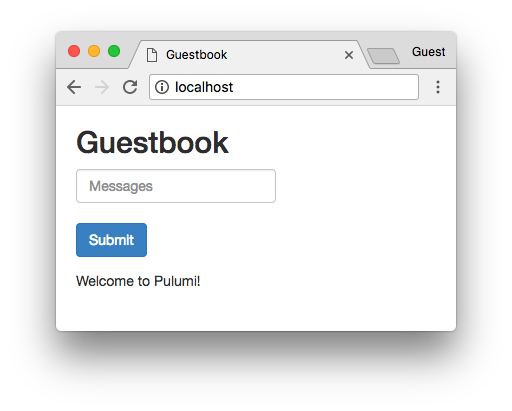

[](https://app.pulumi.com/new?template=https://github.com/pulumi/examples/blob/master/kubernetes-cs-guestbook/simple/README.md#gh-light-mode-only)
[](https://app.pulumi.com/new?template=https://github.com/pulumi/examples/blob/master/kubernetes-cs-guestbook/simple/README.md#gh-dark-mode-only)

# Kubernetes Guestbook (Simple Variant)

A version of the [Kubernetes Guestbook](https://kubernetes.io/docs/tutorials/stateless-application/guestbook/)
application using Pulumi.

## Running the App

Follow the steps in [Pulumi Installation](https://www.pulumi.com/docs/get-started/install/) and [Kubernetes Setup](https://www.pulumi.com/docs/intro/cloud-providers/kubernetes/setup/) to get Pulumi working with Kubernetes.

Create a new stack:

```sh
$ pulumi stack init
Enter a stack name: testbook
```

This example will attempt to expose the Guestbook application to the Internet with a `Service` of
type `LoadBalancer`. Since minikube does not support `LoadBalancer`, the Guestbook application
already knows to use type `ClusterIP` instead; all you need to do is to tell it whether you're
deploying to minikube:

```sh
pulumi config set isMinikube <value>
```

Perform the deployment:

```sh
$ pulumi up
Updating stack 'testbook'
Performing changes:

     Type                           Name                       Status
 +   pulumi:pulumi:Stack            guestbook-csharp-testbook  created
 +   ├─ kubernetes:apps:Deployment  redis-replica              created
 +   ├─ kubernetes:apps:Deployment  frontend                   created
 +   ├─ kubernetes:apps:Deployment  redis-leader               created
 +   ├─ kubernetes:core:Service     redis-leader               created
 +   ├─ kubernetes:core:Service     redis-replica              created
 +   └─ kubernetes:core:Service     frontend                   created

Outputs:
  + FrontendIp: "35.232.147.18"

Resources:
    + 7 created

Duration: 17s

Permalink: https://app.pulumi.com/lukehoban/guestbook-csharp/testbook/updates/1
```

And finally - open the application in your browser to see the running application. If you're running
macOS you can simply run:

```sh
open $(pulumi stack output FrontendIp)
```

> _Note_: minikube does not support type `LoadBalancer`; if you are deploying to minikube, make sure
> to run `kubectl port-forward svc/frontend 8080:80` to forward the cluster port to the local
> machine and access the service via `localhost:8080`.


