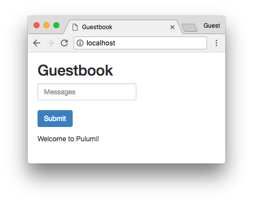

# Kubernetes Guestbook

A version of the [Kubernetes Guestbook](https://kubernetes.io/docs/tutorials/stateless-application/guestbook/) app using
Pulumi and `@pulumi/kubernetes`.

## Running the App

Follow the steps in [Pulumi Installation and Setup](https://docs.pulumi.com/install/) and [Configuring Pulumi
Kubernetes](https://docs.pulumi.com/reference/kubernetes.html#configuration) to get setup with Pulumi and Kubernetes.

> *Note*: The code in this repo assumes you are deploying to a cluster that supports the
> [`LoadBalancer`](https://kubernetes.io/docs/concepts/services-networking/service/#type-loadbalancer) service type.
> This includes most cloud providers as well as [Docker for Mac Edge w/
> Kubernetes](https://docs.docker.com/docker-for-mac/kubernetes/). If not (for example if you are targeting `minikube`
> or your own custom Kubernetes cluster), replace `type: "LoadBalancer"` with `type: "ClusterIP"` in `index.ts`.  See
> the Kubernetes [Services
> docs](https://kubernetes.io/docs/concepts/services-networking/service/#publishing-services---service-types) for more
> details.

Install dependencies:

```
$ npm install
```

Create a new stack:

```
$ pulumi stack init
Enter a stack name: testing
```

Preview the deployment of the application:

``` 
$ pulumi preview
Previewing stack 'testing' in the Pulumi Cloud ☁️
Previewing changes:

pulumi:Stack("guestbook-testing"):     Completed
kubernetes:Service("frontend"):        + Would create
kubernetes:Service("redis-slave"):     + Would create
kubernetes:Service("redis-master"):    + Would create
kubernetes:Deployment("redis-master"): + Would create
kubernetes:Deployment("frontend"):     + Would create
kubernetes:Deployment("redis-slave"):  + Would create
info: 7 changes previewed:
    + 7 resources to create
```

Perform the deployment:

```
$ pulumi update
Updating stack 'testing' in the Pulumi Cloud ☁️
Performing changes:

pulumi:Stack("guestbook-testing"):     Completed
kubernetes:Service("frontend"):        + Created
kubernetes:Service("redis-slave"):     + Created
kubernetes:Service("redis-master"):    + Created
kubernetes:Deployment("redis-master"): + Created
kubernetes:Deployment("frontend"):     + Created
kubernetes:Deployment("redis-slave"):  + Created
info: 7 changes performed:
    + 7 resources created
Update duration: 3.535908863s

Permalink: https://pulumi.com/pulumi/examples/guestbook/testing/updates/1
```

The application is now deployed.  Use `kubectl` to see the deployed services.

```
$ kubectl get services
NAME           TYPE           CLUSTER-IP       EXTERNAL-IP   PORT(S)        AGE
frontend       LoadBalancer   10.98.65.192     localhost     80:30235/TCP   51m
redis-master   ClusterIP      10.99.238.82     <none>        6379/TCP       51m
redis-slave    ClusterIP      10.111.117.113   <none>        6379/TCP       51m
```

And finally - open the application in your browser to see the running application.

> *Note*: If you are deploying to a cluster that does not support `type: "LoadBalancer"`, and deployed the example using
> `type: "ClusterIP"` instead, run `kubectl port-forward svc/frontend 8080:80` to forward the cluster port to the local
> machine and access the service via `localhost:8080`.



Or `curl` it from your CLI:

```
$ curl localhost:80
<html ng-app="redis">
  <head>
    <title>Guestbook</title>
    <link rel="stylesheet" href="//netdna.bootstrapcdn.com/bootstrap/3.1.1/css/bootstrap.min.css">
    <script src="https://ajax.googleapis.com/ajax/libs/angularjs/1.2.12/angular.min.js"></script>
    <script src="controllers.js"></script>
    <script src="https://cdnjs.cloudflare.com/ajax/libs/angular-ui-bootstrap/0.13.0/ui-bootstrap-tpls.js"></script>
  </head>
  <body ng-controller="RedisCtrl">
    <div style="width: 50%; margin-left: 20px">
      <h2>Guestbook</h2>
    <form>
    <fieldset>
    <input ng-model="msg" placeholder="Messages" class="form-control" type="text" name="input"><br>
    <button type="button" class="btn btn-primary" ng-click="controller.onRedis()">Submit</button>
    </fieldset>
    </form>
    <div>
      <div ng-repeat="msg in messages track by $index">
        {{msg}}
      </div>
    </div>
    </div>
  </body>
</html>
```

