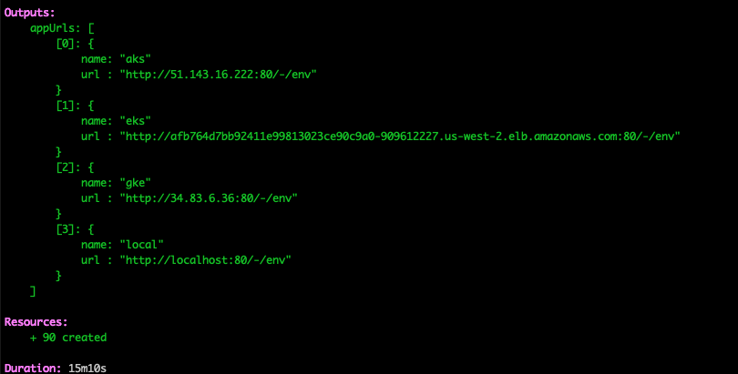
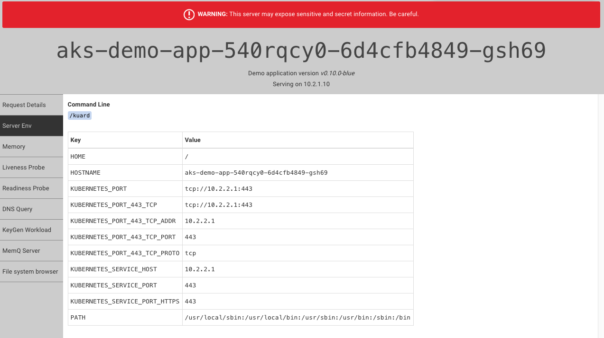

[](https://app.pulumi.com/new?template=https://github.com/pulumi/examples/blob/master/kubernetes-ts-multicloud/README.md#gh-light-mode-only)
[](https://app.pulumi.com/new?template=https://github.com/pulumi/examples/blob/master/kubernetes-ts-multicloud/README.md#gh-dark-mode-only)

# Kubernetes Application Deployed To Multiple Clusters

This example creates managed Kubernetes clusters using AKS, EKS, and GKE, and deploys the application
on each cluster.

## Deploying the App

To deploy your infrastructure, follow the below steps.

### Prerequisites

1. [Install Pulumi](https://www.pulumi.com/docs/get-started/install/)
2. [Install Node.js](https://nodejs.org/en/download/)
3. (Optional) [Configure AWS Credentials](https://www.pulumi.com/docs/intro/cloud-providers/aws/setup/)
4. (Optional) [Configure Azure Credentials](https://www.pulumi.com/docs/intro/cloud-providers/azure/setup/)
5. (Optional) [Configure GCP Credentials](https://www.pulumi.com/docs/intro/cloud-providers/gcp/setup/)
6. (Optional) [Configure local access to a Kubernetes cluster](https://kubernetes.io/docs/setup/)

### Steps

After cloning this repo, from this working directory, run these commands:

1. Install the required Node.js packages:

    ```bash
    $ npm install
    ```

2. Create a new stack, which is an isolated deployment target for this example:

    ```bash
    $ pulumi stack init
    ```

3. Set the required configuration variables for this program:

    ```bash
    $ pulumi config set aws:region us-west-2                # Any valid AWS region here.
    $ pulumi config set azure:location westus2              # Any valid Azure location here.
    $ pulumi config set gcp:project [your-gcp-project-here]
    $ pulumi config set gcp:zone us-west1-a                 # Any valid GCP zone here.
    ```

   Note that you can choose different regions here.

   We recommend using `us-west-2` to host your EKS cluster as other regions (notably `us-east-1`) may have capacity
   issues that prevent EKS clusters from creating.

4. (Optional) Disable any clusters you do not want to deploy by commenting out the corresponding lines in
   the `index.ts` file. All clusters are enabled by default.

5. Bring up the stack, which will create the selected managed Kubernetes clusters, and deploy an application to each of
   them.

    ```bash
    $ pulumi up
    ```

   Here's what it should look like once it completes:
   

6. You can connect to the example app (kuard) on each cluster using the exported URLs.
   

   Important: This application is exposed publicly over http, and can be used to view sensitive details about the
   node. Do not run this application on production clusters!

7. Once you've finished experimenting, tear down your stack's resources by destroying and removing it:

    ```bash
    $ pulumi destroy --yes
    $ pulumi stack rm --yes
    ```

   Note: The static IP workaround required for the AKS Service can cause a destroy failure if the IP has not
   finished detaching from the LoadBalancer. If you encounter this error, simply rerun `pulumi destroy --yes`,
   and it should succeed.
