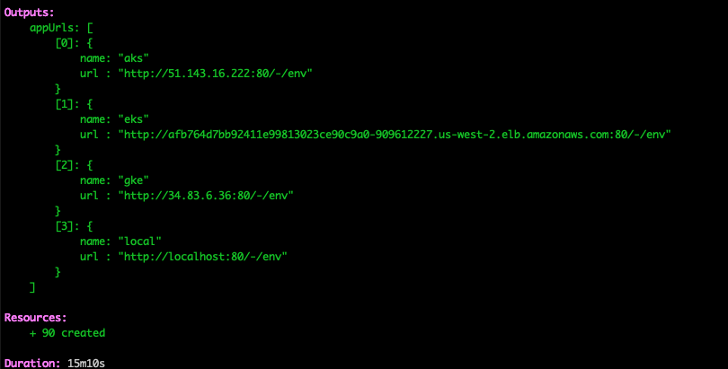
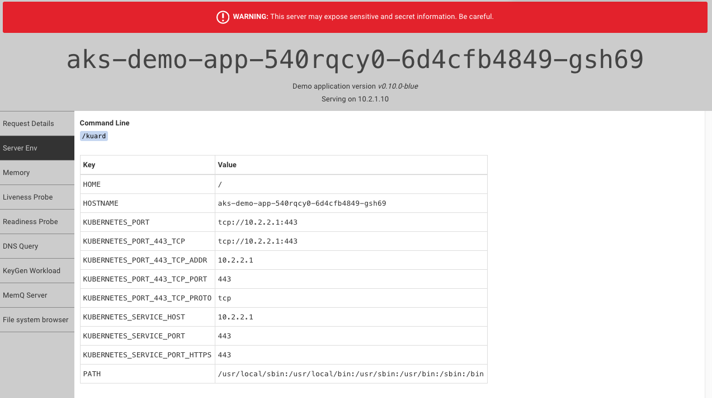

[](https://app.pulumi.com/new?template=https://github.com/pulumi/examples/blob/master/kubernetes-ts-multicloud/README.md#gh-light-mode-only)
[](https://app.pulumi.com/new?template=https://github.com/pulumi/examples/blob/master/kubernetes-ts-multicloud/README.md#gh-dark-mode-only)

# Kubernetes application deployed to multiple clusters

This example creates managed Kubernetes clusters using AKS, EKS, and GKE, and deploys the application
on each cluster.

## Prerequisites

1. [Install Pulumi](https://www.pulumi.com/docs/get-started/install/)
2. [Install Node.js](https://www.pulumi.com/docs/intro/languages/javascript/)
3. (Optional) [Configure AWS credentials](https://www.pulumi.com/docs/intro/cloud-providers/aws/setup/)
4. (Optional) [Configure Azure credentials](https://www.pulumi.com/docs/intro/cloud-providers/azure/setup/)
5. (Optional) [Configure GCP credentials](https://www.pulumi.com/docs/intro/cloud-providers/gcp/setup/)
6. (Optional) [Configure local access to a Kubernetes cluster](https://kubernetes.io/docs/setup/)

## Deploying the example

1.  Create a new stack:

    ```bash
    pulumi stack init dev
    ```

1.  Set the required configuration variables for this program:

    ```bash
    pulumi config set aws:region us-west-2                # Any valid AWS region here.
    pulumi config set azure:location westus2              # Any valid Azure location here.
    pulumi config set gcp:project [your-gcp-project-here]
    pulumi config set gcp:zone us-west1-a                 # Any valid GCP zone here.
    ```

    Note that you can choose different regions here. We recommend using `us-west-2` to host your EKS
    cluster as other regions (notably `us-east-1`) may have capacity issues that prevent EKS clusters
    from creating.

1.  (Optional) Disable any clusters you do not want to deploy by commenting out the corresponding lines in
    the `index.ts` file. All clusters are enabled by default.

1.  Install dependencies:

    ```bash
    npm install
    ```

1.  Deploy the stack, which will create the selected managed Kubernetes clusters, and deploy an
    application to each of them:

    ```bash
    pulumi up
    ```

    Here's what it should look like once it completes:
    

1.  You can connect to the example app (kuard) on each cluster using the exported URLs.
    

    Important: This application is exposed publicly over HTTP, and can be used to view sensitive details about the
    node. Do not run this application on production clusters!

## Cleaning up

Once you've finished experimenting, tear down your stack's resources by destroying and removing it:

```bash
pulumi destroy
pulumi stack rm
```

Note: The static IP workaround required for the AKS Service can cause a destroy failure if the IP has not
finished detaching from the LoadBalancer. If you encounter this error, simply rerun `pulumi destroy`,
and it should succeed.
