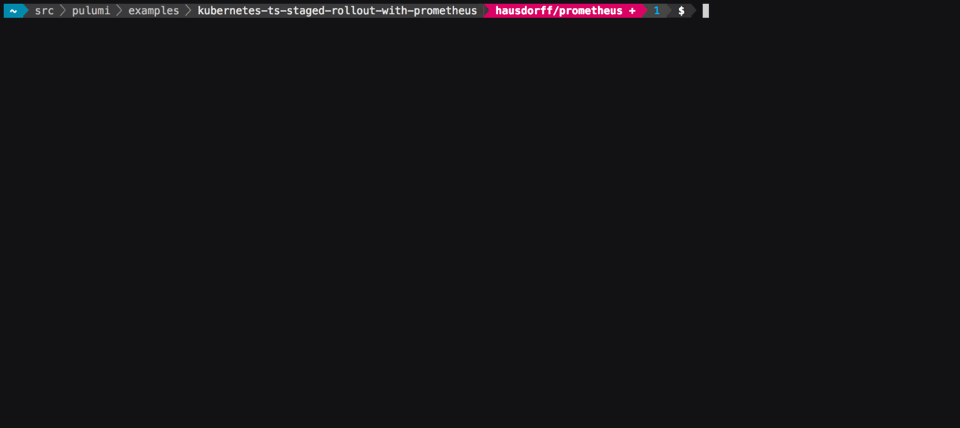

[](https://app.pulumi.com/new?template=https://github.com/pulumi/examples/blob/master/kubernetes-ts-staged-rollout-with-prometheus/README.md#gh-light-mode-only)
[](https://app.pulumi.com/new?template=https://github.com/pulumi/examples/blob/master/kubernetes-ts-staged-rollout-with-prometheus/README.md#gh-dark-mode-only)

# Staged App Rollout Gated by Prometheus Checks

Demonstrates how to create a staged rollout (from 3-replica canary -> 10-replica staging), gated by
checking that the P90 response time reported by Prometheus is less than some amount. We first deploy
[Prometheus][p8s] using a [Helm][helm] Chart, then deploy a Prometheus-instrumented application
using two `Deployment` objects, with a gated check between them.

The relevant gating code in `index.ts` looks like this:

```typescript
// Canary ring. Replicate instrumented Pod 3 times.
const canary = new k8s.apps.v1beta1.Deployment(
    "canary-example-app",
    { spec: { replicas: 1, template: instrumentedPod } },
    { dependsOn: p8sDeployment }
);

// Staging ring. Replicate instrumented Pod 10 times.
const staging = new k8s.apps.v1beta1.Deployment("staging-example-app", {
    metadata: {
        annotations: {
            // Check P90 latency is < 100,000 microseconds. Returns a `Promise<string>` with the P90
            // response time. It must resolve correctly before this deployment rolls out. In
            // general any `Promise<T>` could go here.
            "example.com/p90ResponseTime": util.checkHttpLatency(canary, containerName, {
                durationSeconds: 60,
                quantile: 0.9,
                thresholdMicroseconds: 100000,
                prometheusEndpoint: `localhost:${localPort}`,
                forwarderHandle: forwarderHandle
            })
        }
    },
    spec: { replicas: 1, template: instrumentedPod }
});
```

When the program is run, it will look something like the following (although this is sped up by 8x).
The majority of the time is taken up by deploying Prometheus. Towards the end, at the bottom, you
can see `canary-example-app` and `canary-staging-app` created.



## Running the App

1. If you haven't already, follow the steps in [Pulumi Installation and Setup][install] and
   [Configuring Pulumi Kubernetes][configuration] to get setup with Pulumi and Kubernetes.

1. Now, install dependencies:

   ```sh
   npm install
   ```

1. Create a new stack:

   ```sh
   $ pulumi stack init
   Enter a stack name: staged-rollout
   ```

1. **IMPORTANT NOTE:** The code in `index.ts` is meant to be run out-of-cluster (_e.g._, on your
   local machine). It will thus call `kubectl port-forward` on your behalf so that the Prometheus
   service is forwarded to your local machine, which allows this program to poll for metrics. **If
   you are running Pulumi in-cluster, you can comment out this part of the example.**

1. Perform the deployment:

   ```sh
   $ pulumi up
   Updating stack 'staged-rollout'
   Performing changes:

        Type                           Name                 Status      Info
    +   pulumi:pulumi:Stack                                            prometheus-staged-rollout
    +   ├─ kubernetes:helm.sh:Chart                                    p8s                                created
    +   │  ├─ kubernetes:core:ServiceAccount                           p8s-prometheus-alertmanager        created
    +   │  ├─ kubernetes:core:ServiceAccount                           p8s-prometheus-pushgateway         created
    +   │  ├─ kubernetes:core:ServiceAccount                           p8s-prometheus-kube-state-metrics  created
    +   │  ├─ kubernetes:core:ServiceAccount                           p8s-prometheus-server              created
    +   │  ├─ kubernetes:core:ServiceAccount                           p8s-prometheus-node-exporter       created
    +   │  ├─ kubernetes:core:ConfigMap                                p8s-prometheus-alertmanager        created
    +   │  ├─ kubernetes:rbac.authorization.k8s.io:ClusterRoleBinding  p8s-prometheus-server              created
    +   │  ├─ kubernetes:core:PersistentVolumeClaim                    p8s-prometheus-server              created
    +   │  ├─ kubernetes:rbac.authorization.k8s.io:ClusterRoleBinding  p8s-prometheus-kube-state-metrics  created
    +   │  ├─ kubernetes:core:ConfigMap                                p8s-prometheus-server              created
    +   │  ├─ kubernetes:core:PersistentVolumeClaim                    p8s-prometheus-alertmanager        created
    +   │  ├─ kubernetes:core:Service                                  p8s-prometheus-alertmanager        created
    +   │  ├─ kubernetes:core:Service                                  p8s-prometheus-kube-state-metrics  created
    +   │  ├─ kubernetes:core:Service                                  p8s-prometheus-pushgateway         created
    +   │  ├─ kubernetes:core:Service                                  p8s-prometheus-node-exporter       created
    +   │  ├─ kubernetes:extensions:Deployment                         p8s-prometheus-kube-state-metrics  created
    +   │  ├─ kubernetes:core:Service                                  p8s-prometheus-server              created
    +   │  ├─ kubernetes:extensions:Deployment                         p8s-prometheus-pushgateway         created
    +   │  ├─ kubernetes:rbac.authorization.k8s.io:ClusterRole         p8s-prometheus-kube-state-metrics  created
    +   │  ├─ kubernetes:extensions:DaemonSet                          p8s-prometheus-node-exporter       created
    +   │  ├─ kubernetes:extensions:Deployment                         p8s-prometheus-alertmanager        created
    +   │  ├─ kubernetes:extensions:Deployment                         p8s-prometheus-server              created
    +   │  └─ kubernetes:rbac.authorization.k8s.io:ClusterRole         p8s-prometheus-server              created
    +   ├─ kubernetes:apps:Deployment                                  canary-example-app                 created
    +   └─ kubernetes:apps:Deployment                                  staging-example-app                created

   Diagnostics:
     pulumi:pulumi:Stack: prometheus-test-p8s
       info: Checking HTTP metrics

       ---outputs:---
     + p90ResponseTime: "8221.236"

   info: 2 changes performed:
       + 2 resources created
         26 resources unchanged
   Update duration: 7.362744393s

   Permalink: https://app.pulumi.com/hausdorff/test-p8s/updates/1
   ```

   One useful sidenote, we can see here in the `---outputs:---` section that the `p90ResponseTime`
   that was computed by the promise is `export`ed, which causes Pulumi to report its value just
   before it terminates.

[install]: https://www.pulumi.com/docs/get-started/install/
[configuration]: https://www.pulumi.com/docs/intro/cloud-providers/kubernetes/setup/
[p8s]: https://prometheus.io/
[helm]: https://www.helm.sh/
