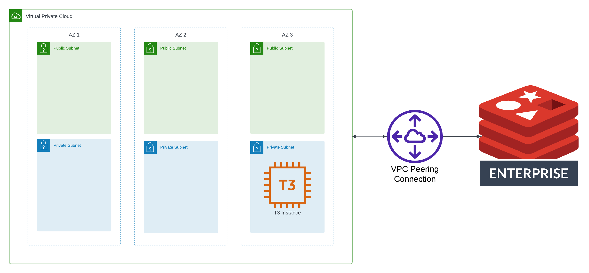
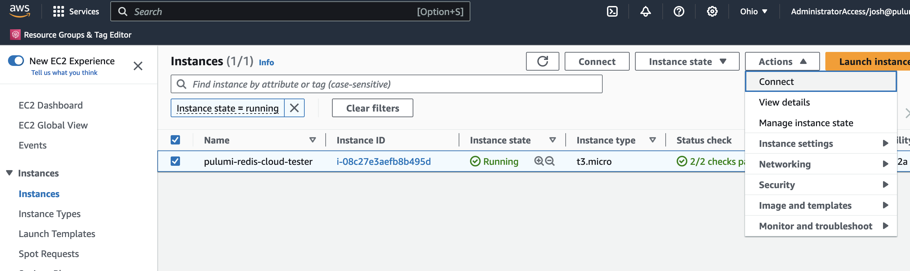
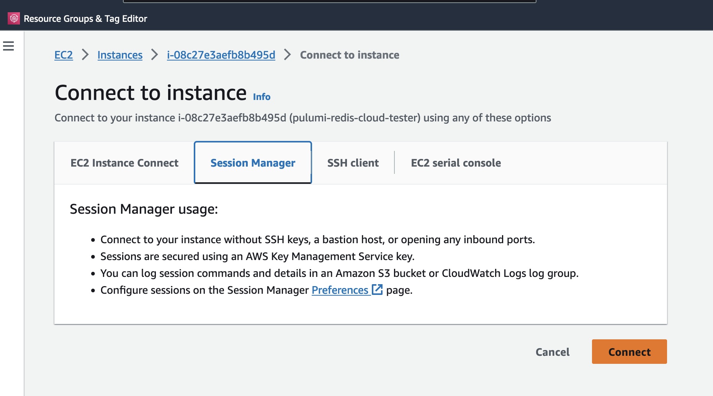
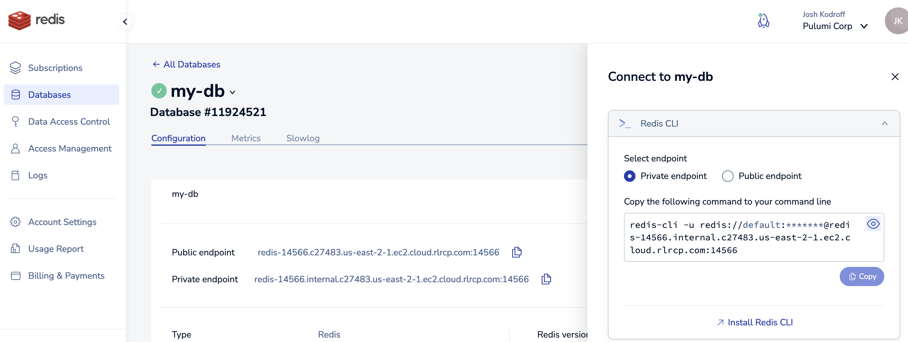
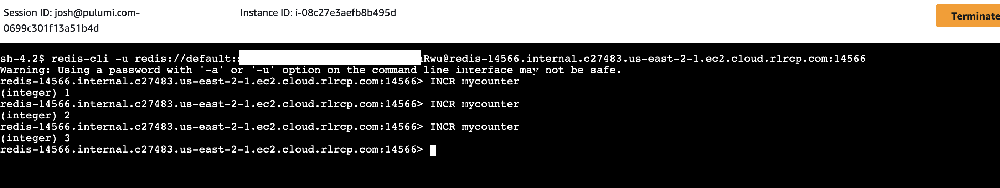

[](https://app.pulumi.com/new?template=https://github.com/pulumi/examples/blob/master/redis-cloud-aws-ts/README.md#gh-light-mode-only)
[](https://app.pulumi.com/new?template=https://github.com/pulumi/examples/blob/master/redis-cloud-aws-ts/README.md#gh-dark-mode-only)

# Redis Enterprise Cloud AWS Example

This example contains code that creates a [Redis Enterprise Cloud](https://app.redislabs.com/) cluster and connects it to an AWS VPC via VPC Peering. This stack also includes an EC2 instance with SSM Session Manager that can run Redis commands to verify connectivity to the Redis cluster.



## Prerequisites

1. [Install Pulumi](https://www.pulumi.com/docs/get-started/install/)
1. [Configure the Redis Cloud provider](https://www.pulumi.com/registry/packages/rediscloud/installation-configuration/)
1. Ensure you have a payment method specified in the Redis Enterprise Cloud console.
1. [Configure the AWS Classic provider](https://www.pulumi.com/registry/packages/aws/installation-configuration/)
1. [Install NodeJS](https://nodejs.org/en/download)

## Deploy the app

1. Set configuration values for your Redis Cloud payment information:

    ```bash
    pulumi config set cardType <YOUR-CARD-TYPE> # e.g. Visa (capitalization matters)
    pulumi config set lastFourNumbers 1234
    ```

1. If you are using an availability zone other than `us-east-1`, you will need to set `preferredAz`, e.g. if you're using `us-west-2`:

    ```bash
    pulumi config set aws:region us-west-2 # Not necessary if your default AWS region is e.g. us-west-2
    pulumi config set preferredAz usw2-az1 # This step is necessary is your default or selected region is not us-east-1
    ```

1. Deploy the architecture:

    ```bash
    pulumi up
    ```

## Test the architecture

1. In the AWS Console, find the EC2 instance named `pulumi-redis-cloud-tester`, and connect to it via SSM Systems Manager:

    
    

1. In the [Redis Cloud console](https://app.redislabs.com/), locate your database, and select "Connect":

1. In the connection dialog, copy the connection info for the Redis CLI:

    

1. Paste the command into the Systems Manager shell prompt, which will connect you to the Redis instance. From there you can run Redis commands like `INCR` that will write to the Redis cluster:

    

## Clean up

1. Run `pulumi destroy` to tear down all resources.
1. To delete the stack itself, run `pulumi stack rm`. Note that this command deletes all deployment history from the Pulumi Cloud console.
