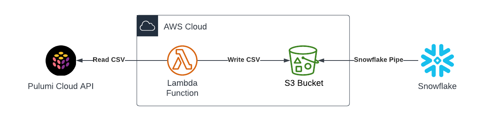
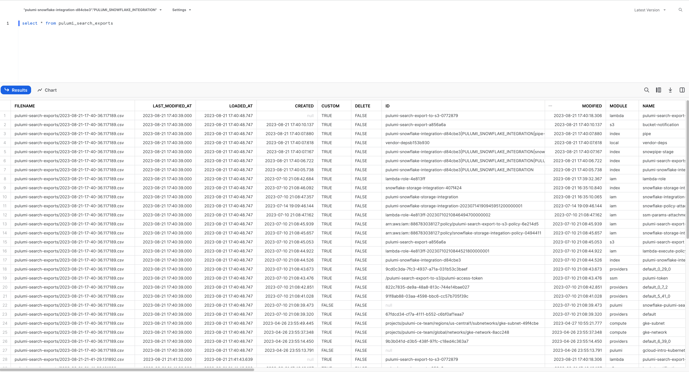

# Pulumi Cloud Data Export to Snowflake using AWS Lambda

This folder contains an example to extract [Pulumi Cloud Data Export](https://www.pulumi.com/docs/pulumi-cloud/cloud-rest-api/#data-export) and load it into Snowflake. Pulumi Cloud's exported data contains detailed information about all of your resources that are managed by Pulumi. After deploying and running this example, you can query your Pulumi Cloud data in Snowflake directly or join it to other data sets of your choosing (like pricing) to create dashboards that provide valuable visibility into your organization's cloud usage.

The infrastructure contains the following resources:



- An S3 bucket which will contain our exported data from the Pulumi Cloud. (The exported data is in CSV format.)
- An AWS Lambda function that queries the Pulumi Cloud REST API to [export search data](https://www.pulumi.com/docs/pulumi-cloud/cloud-rest-api/#resource-search) and place the file in an S3 bucket.
- Snowflake resources (database, schema, table) to hold the data along with [Snowpipe](https://docs.snowflake.com/en/user-guide/data-load-snowpipe-intro) resources that automatically import the data whenever a file is written to the S3 bucket. The Snowflake table is designed to be append-only while still allowing easy point-in-time queries.

## Prerequisites

1. [Install Pulumi](https://www.pulumi.com/docs/get-started/install/)
1. [Configure AWS credentials](https://www.pulumi.com/registry/packages/aws/installation-configuration/#configuration)
1. [Configure Snowflake credentials](https://www.pulumi.com/registry/packages/snowflake/installation-configuration/#configuring-credentials)
1. [Install Python](https://www.pulumi.com/docs/languages-sdks/python/)

## Deploy the App

### Step 1: Initialize the Project

1. Install packages:

    ```bash
    python3 -m venv venv
    venv/bin/pip install -r requirements.txt
    ```

1. Create a new Pulumi stack:

    ```bash
    pulumi stack init
    ```

1. Deploy the Pulumi stack:

    ```bash
    pulumi up
    ```

Once the `pulumi up` command completes, we'll execute the Lambda which will pull the data from the Pulumi Cloud API and place it in the S3 bucket.

### Step 2: Trigger the Lambda

Trigger the Lambda with the following command:

```bash
aws lambda invoke --function-name $(pulumi stack output lambdaArn) /dev/stdout
```

You should see output similar to the following:

```json
{
    "StatusCode": 200,
    "ExecutedVersion": "$LATEST"
}
```

After a few seconds, your data should be visible in your Snowflake database:



## Clean Up

Once you're finished experimenting, you can destroy your stack and remove it to avoid incurring any additional cost:

```bash
pulumi destroy
pulumi stack rm
```

## Summary

In this tutorial, you created a simple extract/load process that exports data from the Pulumi Cloud API to Snowflake. Now you can query this data in Snowflake and join it with other data sets to gain valuable insights into your organization's cloud usage!

## Next Steps

To enhance this architecture, you could [add a rule to run the Lambda on a schedule](https://docs.aws.amazon.com/eventbridge/latest/userguide/eb-run-lambda-schedule.html).
